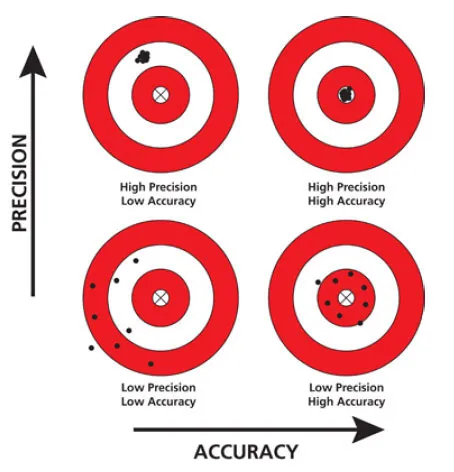

# Sig Digs

## Measured vs Certain Values

- measurements cannot be precise because measuring tools have limits
    - no measurement tool can read out to infinity
    - all measurements have fixed amount of sig digs
- exact values: counting
    - all digits in exact values are certain
    - infinite # of sig digs

## Precision vs Accuracy

- accuracy: how close your results are to the correct value
- precision: how close your results/measurements are to each other

## Uncertainty vs Certainty

In a number, the last digit is **always estimated**

Rest of digits are certain

- uncertain: estimated values
- certain: exact digit/value, no estimation

e.g. 13.5 —> 13 is certain, .5 is estimated

e.g. 12.77 —> 12.7 is certain, last 7 is estimated

:warning: e.g. 16.0 —> 16 is certain, .0 is estimated

:warning: e.g. 16 —> 1 is certain, 6 is estimated

## Significant Digits

- significant digits (sig digs): a count of how precise a measurement is (incl. certain and uncertain digits)
- results and calculations should not be more accurate than measurements

### How to count them

- ✅ Non-zero digits are always counted as sig figs
    - 1234 has 4 sig figs
- ❌ Leading zeros (seen in decimals) are not counted as sig figs
    - 0.0056 has 2 sig figs (0.00 is ignored)
- ✅ Captive zeros (0s in between non-zero digits) are counted as sig figs
    - 100.04 has 5 sig figs
- ❌ Trailing zeros are not counted when there is no decimal
    - 1000 has 1 sig fig
- ✅ Trailing zeros are counted in decimal numbers (or where decimal is shown)
    - 15.50 has 4 sig figs, 100.00 has 5 sig figs

## Arithmetic w/ Sig Figs

- ✖️➗ multiplication/division —> result should have the same sig figs as the value w/ least # of sig figs
    - e.g. 0.1 x 10.12 = 1 (least 1 sig fig)
- ➕➖ addition/subtraction —> result should have the same sig figs as the value w/ least # of decimals
    - e.g. 0.1 + 10.12 = 10.2 (least 1 decimal place)

## Examples of Exact Values

exact values have infinite sig figs

- 2 chairs
- 9 guns
- num of meters in km (defined value)