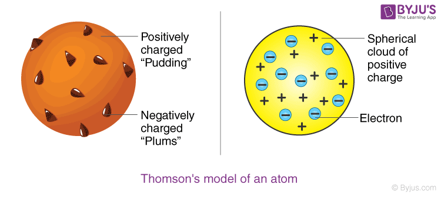
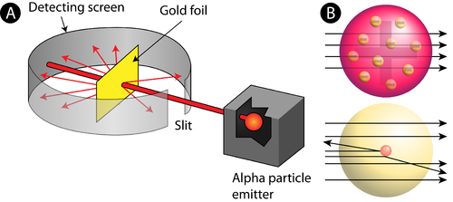
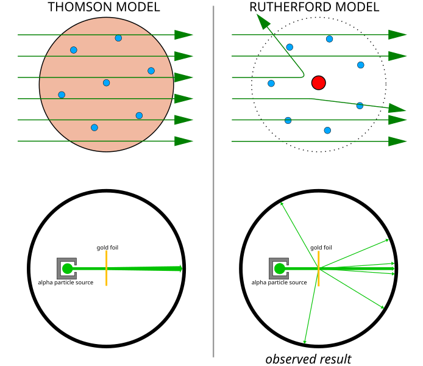
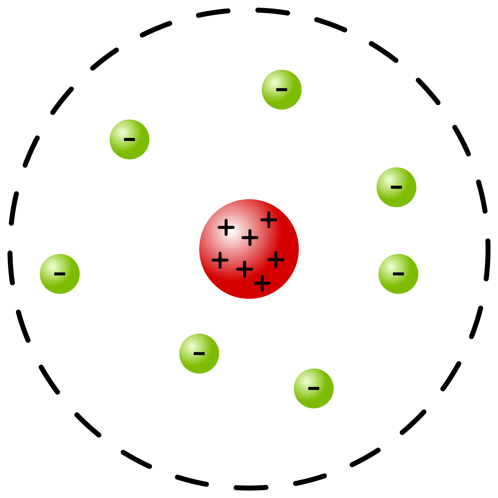
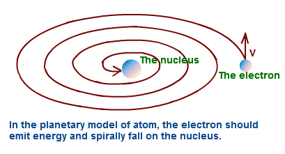
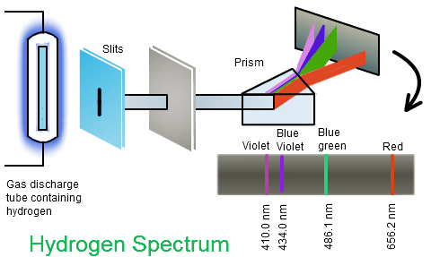
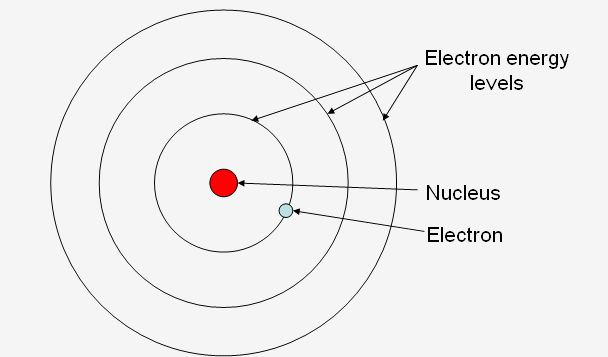
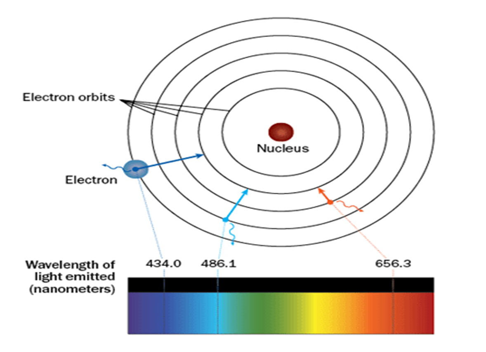

# C1.1 - Atomic Model History

## Scientific Model

**scientific model:** visual representation of a theoretical concept

They change over time as new information is found.

## Democritus Atomic Theory

Democritus was a Greek philosopher looking for a description of matter

*(2,400 yrs. ago)*

> Could matter be divided into smaller and smaller pieces forever, or was there a limit to the number of times a piece of matter could be divided? *-Democritus*

**Theory:** Matter cannot be divided into smaller pieces forever; there is a limit

**atomos:** The smallest unit of matter; it is indivisible

### Atomos were:

- small, hard particles
- made of same material
- had different shapes and sizes

#### :x: THEORY REJECTED

Famous philosopher Aristitole proposed that all matter were made of 4 elements: fire, water, air, earth

Democritus's theory became forgetten for the next 2,000 years

**:x: LIMITATION:** Theory was based on just logical thoughts, no evidence provided

## Dalton's Atomic Theory

Democritus's Atomic Theory was revived by John Dalton (English)

He used ***scientific methods*** and ***experimentation evidence*** to support theory

### Dalton Atom Model

- Atoms are solid, indivisible spheres
- All elements are made of atoms
- Atoms are indivisible and indestructible particles
- Atoms of same element are **exactly** alike
- Atoms of different element are different
- Compounds are formed by joining of atoms from 2+ different elements

### :x: Limitations

Doesn't explain how things acquire electrical charge

## Plum Pudding Theory

J.J. Thomson discovered that atoms are made of even smaller particles

### Cathode Ray Tube (CRT) Diagram

### Discovery of the Electron

- CRT: phosphor-coated glass tube vacuum w/ 2 electrodes: cathode (+) and anode (-)
  - name comes from ray flowing from cathode
- High voltage applied to tube to cause beam of particles to flow from cathode to anode
- Ray is detected when cathode ray strikes the phosphor beyond the anode

> Thomson wanted to know whether a cathode ray were just waves of energy or a stream of moving particles

**Experiment:** Place a negative and a positive plate along the sides of the tube

**Observations:** Cathode ray was repelled by the negative plate and attracted to the positive plate

**Reasoning:** Ray is negative in charge and consists of particles w/ mass

*Particles named "**corpuscles**" before being renamed to "electrons"*

#### Mass of "Corpuscles"

- Mass of these particles were determined
- Measured mass by determining how much the rays were bent with varying voltages
- Mass of the "corpuscles" were 2000x smaller than mass of the smallest atom, hydrogen-1

#### Double-Checking & Conclusions

Properties of the cathode ray remained constant no matter what cathode material was used

**Conclusion:** All atoms contain electrons since they can be produced from electrodes varying in material

**Conclusion:** Atoms are electrically neutral, so atoms must contain a positive charge to cancel out electron charge

### The Plum Pudding Model

An atom consists of a "cloud" (sphere) of positive charge with negatively-charged electrons embedded inside it

### :x: Limitations

Could not explain the scattering of alpha particles in the Gold Foil Experiment.

## Rutherford's Nuclear Model

Ernest Rutherford (J.J. Thompson's student) did many experiments to help support the Plum Pudding model

### The Gold Foil Experiment

- Alpha ($\alpha$) particles (+ charge) are helium nuclei
- Detecting screen emits light when alpha particle hits
- Particles are fired at a thin sheet if gold foil
- Surrounding detecting screen records particle hits

#### Setup

- A slit was used to make sure the alpha particles only go through straight
- A vacuum was used to prevent air molecules from blocking alpha particles from moving

#### Expected (L) & Observed Results (R)

All the alpha particles were supposed to go through the foil since the positive charge is spread out and not strong enough to deflect

#### Results

- Most particles passed straight through
- Few particles were deflected
- VERY FEW were deflected back towards the source

#### Conclusions

- The nucleus is small, dense, and positively charged
- Since most alpha particles passed through, atoms are mostly empty space
  - Estimate: nucleus is ~1/10,000 the size of the atom
- Since alpha particles deflected, a nucleus is positive
- ...and holds most of an atom's mass

### The Nuclear Model

- All of an atom's positively-charged particles (protons) are contained in the nucleus
- Electrons orbit around the nucleus in a circular path
- Atom is mostly empty space

### :x: Limitations

Not able to explain why atoms were **stable**

His theory suggests that electrons revolve around the nucleus in a circular path

If that were the case, electrons should lose energy and fall into the nucleus

## The Neutron

James Chadwick, English physicist discovered the neutron in 1932

From experiments, Chadwick found out that:

$$
\text{mass of nuclei} \neq \text{mass of protons}
$$

**neutron:** a neutral particle having almost the same mass as the proton

He reasoned that neutrons are also present in the nucleus

## Bohr's Planetary Model

Niels Bohr, Danish Physicist published a more detailed model of the atom in 1913

His model identified more clearly the locations of electrons

### The Experiment

**Experiment:** Apply thermal and electrical energy to hydrogen gas in a discharge glass tube; *record emitted colors*

**Result:** Only certain colors were recorded on his spectrogram

#### Continous vs Emission Spectrum

#### Observed Results

#### Conclusions

- Line spectrum of hydrogen proves that electron can only be in specific energy levels
- Electrons can only be a fixed distances from nucleus based on their energy levels
- Specific colors of light are emitted when an electron loses energy

### The Planetary Model

- Electrons only exist in certain allowed orbits
- Each orbit has a specific amount of associated energy
- Electrons do not lose energy in the orbits
- Energy of electron increases with further orbits from nucleus

---

- Electrons can jump from one energy level to another
- If an electron absorbs the right amount of energy, it jumps to the next higher energy level
- If it loses (emits) that amount, it jumps back to its previous level
- An electron can never exist in between orbits

### :x: Limitations

Only explains line spectrum of one-electron atoms

Cannot explain line spectra of atoms w/ 2+ electrons

## Qunatum Mechanical Model

Erwin Schrödinger, Austrian physicist developed the "electron cloud" or quantum mechanical model in 1924.

### The Model

- Exact path of electrons cannot be predicted as electrons travel in path
- The region known as the "electron cloud" are were electrons can likely be found
- **Impossible** to determine exact location of electron
- ***Probable*** location of electron based on the electron's energy

## Sources

- Mr. N. Singh
- [Plum Pudding Diagram](https://byjus.com/chemistry/thomsons-model/)
- [Thomson vs Rutherford Model; Gold Foil Experiment](https://commons.wikimedia.org/wiki/File:Geiger-Marsden_experiment_expectation_and_result.svg)
- [Gold Foil Experiment Setup](https://www.collegesidekick.com/study-guides/cheminter/rutherfords-atomic-model/)
- [Nuclear Model Diagram](https://chemistrytalk.org/discovering-the-nucleus-rutherfords-gold-foil-experiment/)