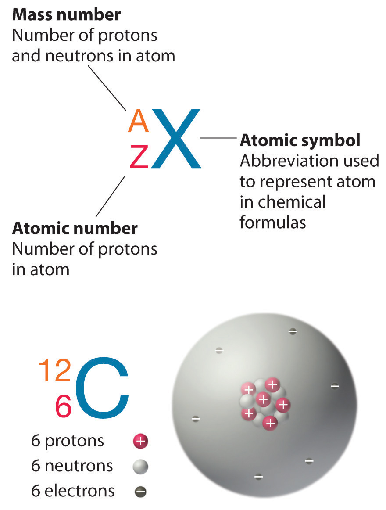
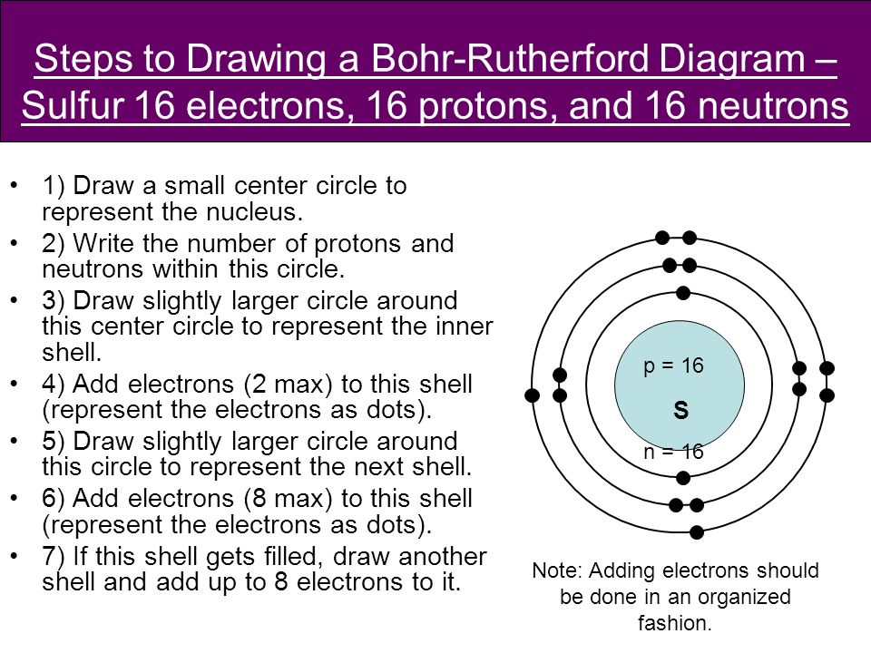
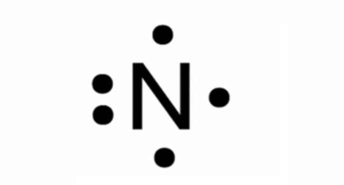

# C1.2 - Atomic Structure

## Structure of the Atom

Atoms are composed of small particles called **subatomic particles**

### Subatomic Particles

- **electrons:** have -1 charge, orbits around the nucleus in energy levels
- **protons:** have +1 charge, located in the nucleus (center)
- **neutrons:** no charge, located in the nucleus

|Particle|Charge|Mass|Location|
|---|---|---|---|
|Electron|-1|1/2000 u|Electron cloud or energy shells|
|Proton|+1|1 u|Nucleus|
|Neutron|0|1 u|Nucleus|

## Atomic Number and Mass

**atomic number ($Z$):** # of protons in an atom

In an atom (neutral)

$$
\begin{gather*}
\text{atomic number}=\text{\# of protons}=\text{\# of electrons} \\
Z=p^+=e^-
\end{gather*}
$$

**mass number ($A$):** # of protons and neutrons in a given atom or isotope

$$
\begin{gather*}
\text{mass number}=\text{\# of protons}+\text{\# of neutrons} \\
A=p^++n^0 \\
\text{which means...} \\
n^0=A-p^+
\end{gather*}
$$

### Standard Atomic Notation

## Bohr Diagrams

### How to Draw

1. Draw small center circle representing nucleus
2. Write # of protons and neutrons in circle
   1. preferred method: $xp^+$, $yn^0$ for $x$ protons and $y$ neutrons
   2. e.g. 7 protons, 8 neutrons gives: $7p^+$ $8n^0$
3. Draw the energy shells as rings
4. Starting from the closest shell and moving up, draw up to max allowed electrons in each shells until all electrons drawn

## Energy Shells

**energy shell:** energy levels in Bohr's model

|Energy Shell|Max Electrons|
|---|---|
|1st|2|
|2nd|8|
|3rd|18|
|4th|32|

Electron arragement written as 2,8,x or 2,8,8,x (last # dependant on electrons in valence shell)

### Valence Shells

**valence shell:** outermost energy shell of atom/ion

**valence electron:** electron in the valence shell

- determine how an atom reacts
- contains electrons that form chemical bonds with other atoms

## Lewis-Dot Diagrams

- Chemical symbol represents nucleus and core electrons (not valence)
- Dots around symbol used to represent valence electrons

### How to Draw

1. Write element symbol
2. Draw dots for each valence electron
3. Place electrons clockwise starting from the top
4. If more than 4 electrons, pair the existing electrons again in the same order

## Sources

- Mr. N. Singh
