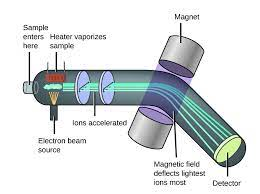
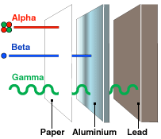

# C3 - Atomic Mass and Isotopes

## Atomic Mass Unit (u)

Definition: 1/12th the mass of a carbon-12 atom

Symbol: u

- Carbon-12 has a mass of 12 u
- Other atoms are measured relative to C-12

## Isotopes

**isotope:** atoms of the same element with a different # of neutrons

## Isotopic Abundance

**abundance:** perctange/fraction of a given isotope in a sample of an element

#### Measuring tool &mdash; Mass Spectrometer

- The dedvice ionizes atoms and molecules with a high-energy electron beam
- Then, it deflects the ions through a magnetic field based on mass : charge ratios
- Lighter isotopes deflected more than heavier isotopes
- Detector plate and computer measures abundance and mass of each isotope
  
## Average Atomic Mass

**relative/average atomic mass ($A_{av}$):** weighted average of all the masses found for each isotope in an element

*variable above is made up by me*

|Isotope|Protons|Neutrons|Abundance (%)|
|--|--|--|--|
|carbon-12|6|6|98.89%|
|carbon-13|6|7|1.11%|
|carbon-14|6|8|<0.01%|

Using weights, $A_{av}\approx 12.011$

Atomic mass of an element is closest to the mass of the most abundant isotope

### Calculating Avg. Atomic Mass

let $A_{av}$ be average atomic mass, $A_n$ be mass of each isotope, $p_n$ be abudance of each isotope, $n$ be the isotope # (1, 2, 3...)

$$
\begin{equation*}
A_{av}=A_1p_1+A_2p_2+...+A_n+p_n 
\end{equation*}
$$

## Radioactive Isotopes

Most abundant isotopes are stable but some break up easily (unstable) due to their nuclear composition

- radioisotope: isotope that spontaneously decays to produce 2+ smaller nuclei and radiation
- radioactive decay: spontaneous disintegration of unstable isotopes
- nuclear radiation: energy or tiny particles emitted from nucleus as it decays &mdash; *Types:*
  - $\alpha$ alpha: emits alpha particles, helium nuclei
  - $\beta$ beta: emits beta particles, fast-moving electrons
  - $\gamma$ gamma: emits gamma rays
  

### Uses

- radioactive iodine-131 used to treat thyroid gland
- americium-241 used in smoke detectors
- cobalt-60 used to kill cancer cells
- carbon-14 used in carbon dating (find approximate age of fossil/organic material)

## Sources

- Mr. N. Singh