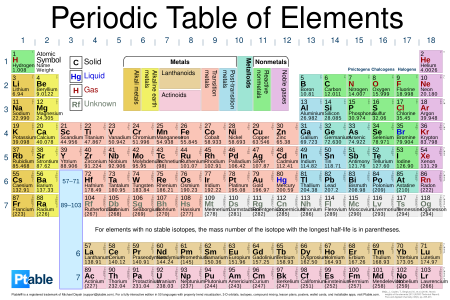
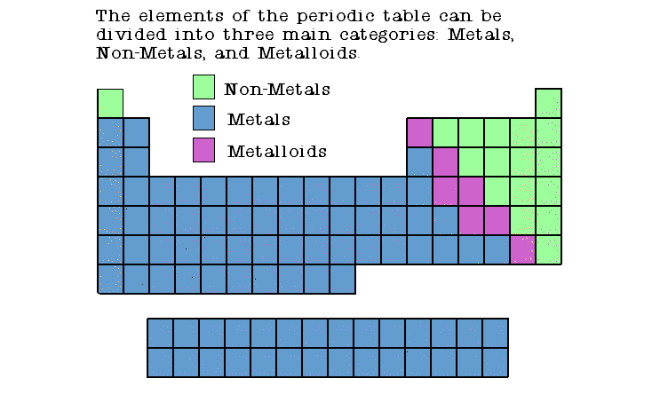
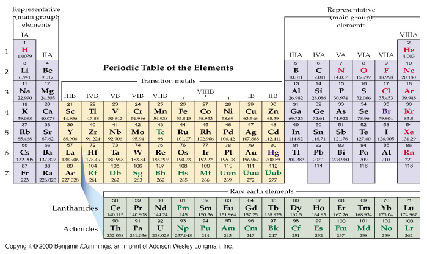

# C1.4 - Periodic Table

## Periodic

**periodic:** anything that repeats in a specific pattern (i.e. days of the week)

## Periodic Table

- organized by rows and by **increasing atomic number**
- **periods:** horizontal rows, labelled from 1-7
- **groups:** veritcal columns, labelled from 1-18

## Groups

**groups:** veritcal columns, labelled from 1-18

- also called family
- elements in same groups have similar chemical properties
- group # is directly related to the number of valence electrons in an element
- elements in same group have same # of valence electrons
- valence electrons determine chemical properties
- group 18 are noble gases and are very stable

### Names of Each Family

- group 1: alkali metals *[1 valence e]*
- group 2: alkaline earth metals *[2 valence e]*
- groups 3-12: transition metals *[varying valence e]*
- group 13: boron group* *[3 valence e]*
- group 14: carbon group* *[4 valence e]*
- group 15: nitrogen group* *[5 valence e]*
- group 16: oxygen group* *[6 valence e]*
- group 17: halogens *[7 valence e]*
- group 18: noble gases *[filled valence shells]*
- elements 57-71: lanthanides
- elements 89-103: actinides

## Periods

**periods:** horizontal rows, labelled from 1-7

period # = # of energy shells in Bohr's atomic model

## Periodic Law

**periodic law:** if elements are arranged by increasing atomic #, their properties show a periodic re-occurance and a gradual change

## Organization of the Table

### Metals, non-metals, and metalloids

- Metals are conductive to heat and electricity
- Non-metals are not conductive to heat and electricity (opposite)
- Metalloids share properties of both metals and non-metals

### Main, Transition, Rare Earth

- main (representative) groups: groups 1, 2, 13-18
- transition groups: groups 3-12
- rare earth metals: lanthanides and actinides

## Sources

- Ptable
- Mr. N. Singh