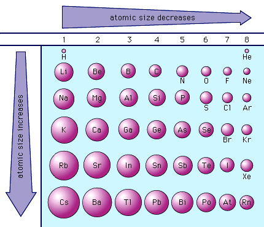
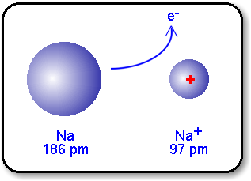
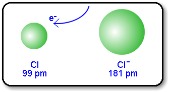
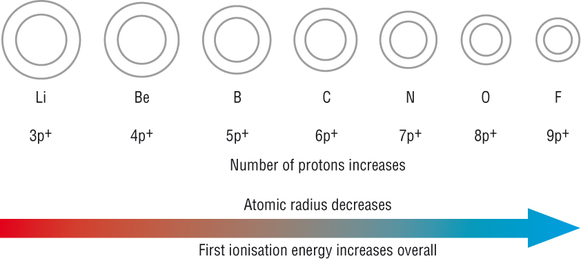
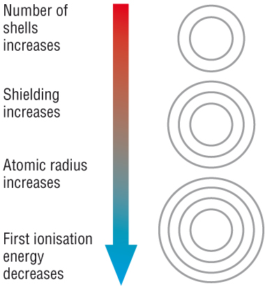
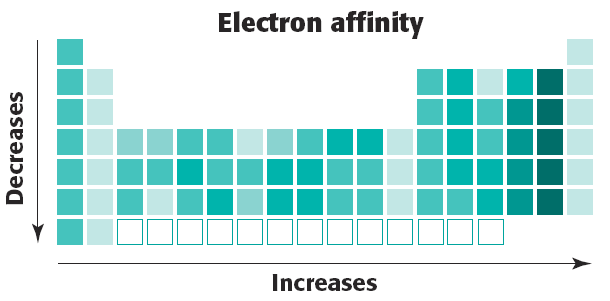
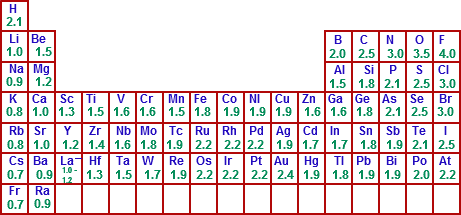
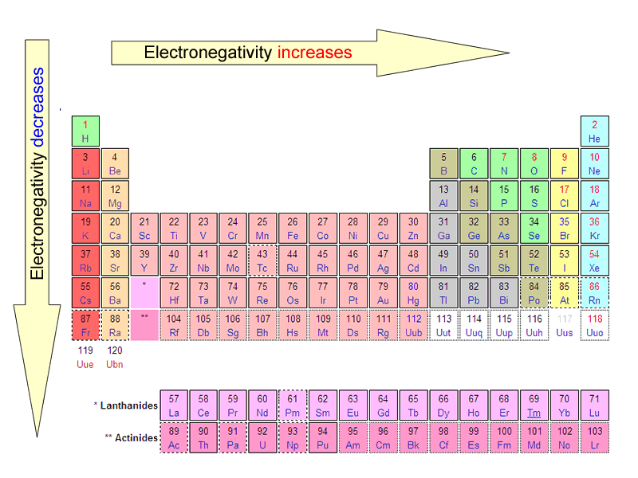

# C1.5 - Periodic Trends

## What are periodic trends?

**periodic trends:** patterns or trends found in the periodic table

**periodic law** states that periodic trends are observed when elements are arranged in increasing atomic number

When looking for periodic trends, prioritize period # over group # *(in general)*

## Effective Nuclear Charge & Shielding Effect

### Effective Nuclear Charge

**effective nuclear charge:** net force experienced by electron due to positive nucleus

- the "pull" that an electron feels from the nucleus
- effective nuclear charge increases, electron cloud pulled in tighter

### Electron Shielding

**shielding electrons:** electrons in-between the valence electrons and the nucleus

**shielding effect:** the shielding electrons shield the valence electrons from the nuclei's positive charge

## Atomic Radius

**atomic radius:** distance from center of atom to outermost electrons

> *typically used to measure atomic size*

- Unit: picometer (pm)
- determined indirectly since boundaries aren't definite

**Alternative Definition**

- 1/2 the distance between 2 nuclei
- value of 140 pm (280 / 2) assinged to iodine atom
- this is measured using X-ray crystallography

### Trends

*alternative visual*

:arrow_forward: As we move left to right across a period, *atomic radius **decreases***

- Atomic # increases
- Effective nuclear charge increases
- Stronger attraction between valence electrons and nucleus

:arrow_down_small: As we move down a group, *atomic radius **increases***

- \# of energy shells increases
- Shielding effect increases
- Weaker attraction between valence elctrons and nucleus

> Example: C, B, Cl, Na, K, Ag, Ba are elements arranged in order by atomic radius
>
> Prioritize location in group over location in period

## Ionic Radius

**ionic radius:** distance between nucleus of ion and its outermost electrons

- Unit: picometer (pm)

### Trends

**Positive ions** are always ***smaller*** than their neutral counterpart

- Less electron shielding
- Attraction between nucleus and valence electrons increase

**Negative ions** are always ***larger*** than their neutral counterpart

- Nuclear charge is shared among more electrons
- Weaker force for attracting electrons

## Ionization Energy

**ionization energy:** energy required to remove an electron from an atom/ion

- Unit: kJ/mol
- Formula? $X(g)+\text{energy}=X(g)^++e^-$

### Trends

:arrow_forward: Ionization energy ***increases*** as we move across a period

- Atomic radius increases
- Outermost electrons further away from nucleus
- Attraction decreased between nucleus and valence electron

:arrow_down_small: Ionization energy ***decreases*** as we move down a group

- Atomic size increases
- Outermost electrons located further away from nucleus
- Attraction between nucleus and valence electrons decreases
- Less energy required to remove outermost electron

## Electron Affinity

**electron affinity:** energy change that occurs when atom gains an electron

- Unit: kJ/mol

### Key Points

- most atoms release energy when they accept electrons (i.e. non-metals), negative # used
- some atoms must be "forced" to gain an electron (i.e. metals), they absorb energy, positive # used

---

- release of energy &rarr; stability *(favored)*
- absorption of energy &rarr; instability *(not favored)*
- stronger electron attraction = more electron relase

### Trends

:arrow_forward: Electron affinity ***increases*** as we move across a period (look at energy released)

- Atomic size decreases
- Incoming electron pulled more easily into atom
- Higher effective nuclear charge

:arrow_down_small: Electron affinity ***decreases*** as we move down a group (look at energy released)

- Distance between incoming electron and nucleus increases down a group
- Greater distance = less attraction = less electron affinity

## Electronegativity

**electronegativity:** ability of an atom to attract bonding electrons to itself

> if an atom was bonded with another atom and fought over their bonding electrons, which atom would win the electron?

- measures attraction for another atom's electrons
- arbitrary scale ranging from 0-4
- unit: Pauling (named after Linus Pauling)
- fluorine is the most electronegative (4.0 Paulings)
- caesium and francium are the least electronegative (0.7 Paulings)
- typically, metals have low electronegatives (e givers) and non-metals and non-metals have high electronegatives (e takers)

### Values

### Trends

:arrow_forward: Electronegativity ***increases*** across a period

- Atomic # increases
- Effective nuclear charge increases
- Atomic radius decreases
- Stronger attraction between nucleus and valence electrons
- Greater ability to attract bonding electrons

:arrow_down_small: Electronegativity ***decreases*** down a group

- \# of energy levels increases
- Shielding effect increases
- Weaker attraction between nucleus and valence electrons
- Atomic radius increases; nucleus further away
- Weaker ability to attract bonding electrons

## Sources

- Mr. N. Singh