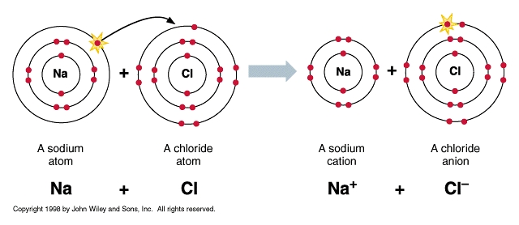
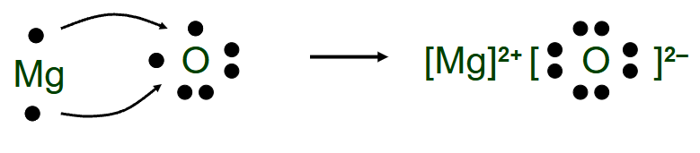
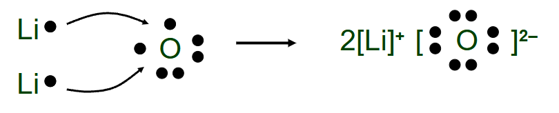
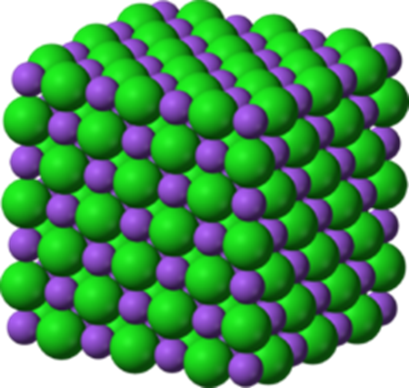
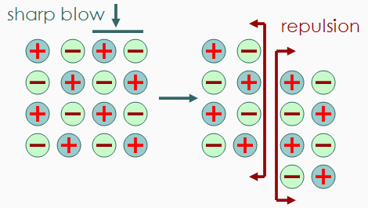
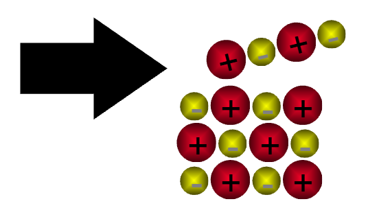

# C2.1 - Ionic Bonding

## Electron Structure & Octet Rule

**octet:** electron arrangement where valence shell is filled w/ 8 $e^-$

Noble gases have an octet, $\therefore$ they are unreactive

> Helium has a **duplet**: 2 outer electrons

Majority of electrons do not have an octet (duplet for H)

$\therefore$ They achieve octet by *losing*, *gaining*, or *sharing* electrons

**isoelectronic:** same # and distribution of electrons as its nearest noble gas

### Chemical Bond

**chemical bond:** force of attraction that holds 2+ atoms together

## Ionic Bonding

Transfer of valence electrons from a metal to a non-metal

- metal always wants to lose electrons
- non-metal wants to gain electrons

Results:

- cation: positive charged ion (metal)
- anion: negatively charged ion (non-metal)

**ionic bond:** *electrostatic force* of attraction between cation and anion

### Example

A sodium atom transferring its valence electron to a chlorine atom

## Lewis Diagrams &mdash; How to Draw

1. Draw Lewis symbol for each atom
2. Determine how many electrons cation will lose and anion will gain
3. If cation and anion needs to lose/gain different # of electrons, then:
   1. cation charge # of anion needed
   2. anion charge # of cations needed
4. Draw Lewis symbol of cation without any valence electrons in brackets, include charge
5. Draw Lewis symbol of anion with an octet/duplet in brackets, include charge
6. If more than one cation or anion needed, draw a # of how many needed beside the respective ion

#### Examples

## Ionic Structures

**crystal lattice:** arrangement of cations and anions in a rigid, regular, repeating manner

*Example*

## Formula Unit

**formula unit:** smallest repeating unit in a crystal lattice *(other words: chemical formula)*

Ionic compounds do not exist as a single unit like a molecule

## Properties

- high melting points
  - reason: strong forces between ions
- hard and brittle
- soluble in water
- form electrolytes: conducts electricity when dissolved in water

### Why brittle?

*Strong repulsion breaks crystal apart*

Deformation of crystal causes one plane to slide across another plane. 

Then, like charged ions meet and repulse each other, causing seperation

### Conduction in Water

- When ionic compounds dissolve, the ions are seperated
- The free ions can move around conduct electricity
- The cations act as a cathode, the anions act as an anode
  - electrons flow from anode &rarr; cathode

---

- Ionic solids can't conduct because ions are locked in place
- Melted ionic compounds (800 &deg;C) can conduct; *free movement*

### Polyatomic Ions

A covalent compound that acts as a simple entity

#### Examples

- ${\text{NH}_4}^+$ &mdash; ammonium
- ${\text{CO}_3}^{2-}$ &mdash; carbonate
- ${\text{PO}_4}^{3-}$ &mdash; phosphate

## Sources

- Mr. N. Singh