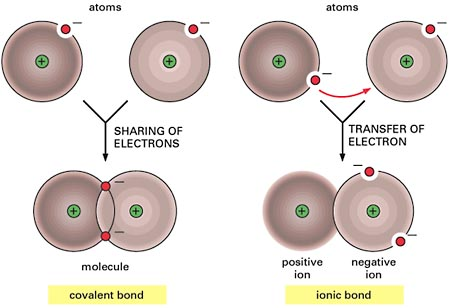
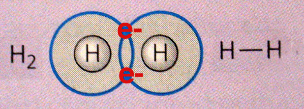
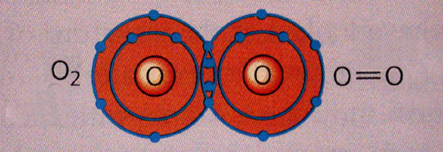
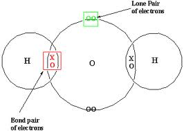
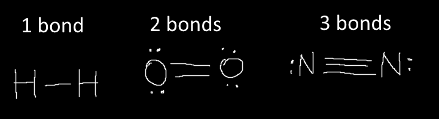

# C2.2 - Covalent Bonding

## Molecular Element

**molecule:** atoms held together by covalent bonds

Made up of 2+ atoms of the same element

- **diatomic**: 2 atoms in a molecular element
- **monatomic**: 1 atom

### 7 Diatomic Molecules

- $\text{H}_2$ &mdash; hydrogen
- $\text{O}_2$ &mdash; oxygen
- $\text{F}_2$ &mdash; fluorine
- $\text{Br}_2$ &mdash; bromine
- $\text{I}_2$ &mdash; iodine
- $\text{N}_2$ &mdash; nitrogen
- $\text{Cl}_2$ &mdash; chlorine

## Molecular Compound

Compound composed of molecules with 2+ non-metals

### Examples

- carbon dioxide
- water
- paraffin wax
- sugar

### Properties

- can either be solid, liquid, or gas
- solids: soft and brittle
- low melting and boiling points
- many don't dissolve in water
- do not form solutions that conduct electricity

## Covalent Bonding

**covalent bond:** bond created by the sharing of valence electrons between 2 atoms

- A pair (2 electrons from both atoms) are shared
- More than 1 pair can be shared
- Bonding is weaker than ionic bonding

**Diagram**

### Types of Covalent Bonds

- **single bond:** bond formed by sharing one pair (2 $e^-$)
  - example: $\text H_2$
  - one line in Lewis diagrams
- **double bond:** bond formed by sharing two pairs (4 $e^-$)
  - example: $\text O_2$, $\text {CO}_2$
  - 2 lines in Lewis diag.
- **triple bond:** bond formed by sharing three pairs (6 $e^-$)
  - example: $\text N_2$
  - 3 lines in Lewis diag.
  
*Single bond*

*Double bond*

### Types of Pairs

- bonding pair: pair shared between two atoms
- lone pair: unshared pair

## Bonding Capacity

**bonding capacity** *(a.k.a. valence)*: # of covalent bonds an atom can form

$\text H$, hydrogen has bonding capacity of 1

Rest of atoms: $\text{bonding capacity}=8-\text{valence electrons}$

## Lewis Structures

**Lewis structure:** Diagram that uses Lewis symbols to represent bonds in a molecule

Rules:

- lone pairs are dots
- shared pair is one line
- single bond: 1 line
- double bond: 2 lines
- triple bond: 3 lines

### How to Draw

1. Get sum of all valence $e^-$ from all atoms
   1. If polyatomic, add absolute charge # of $e^-$ if charge is neg., otherwise subtract
2. Arrange elements so that one atom is in the center
   1. Central atoms are atoms w/ the highest bonding capacity, or the least electronegativity
   2. Carbon is always central
   3. Hydrogen is never central (peripheral)
3. Draw all the normal valence electrons for each atom
4. Create "pairs" between each atom until there is an octet
5. Move lone electrons or pairs if necessary to maintain an octet
6. *If molecule is polyatomic, add electrons or cut out electrons until there is an octet*
7. Draw the final Lewis structure with each bond as a line
8. *Draw square brackets around the the molecule if polyatomic; write charge*
9. Verify that # of total valence $e^-$ equals the original count

*Above requires practice*

Example for $\text{CHCl}_3$

## Sources

- Mr. N. Singh