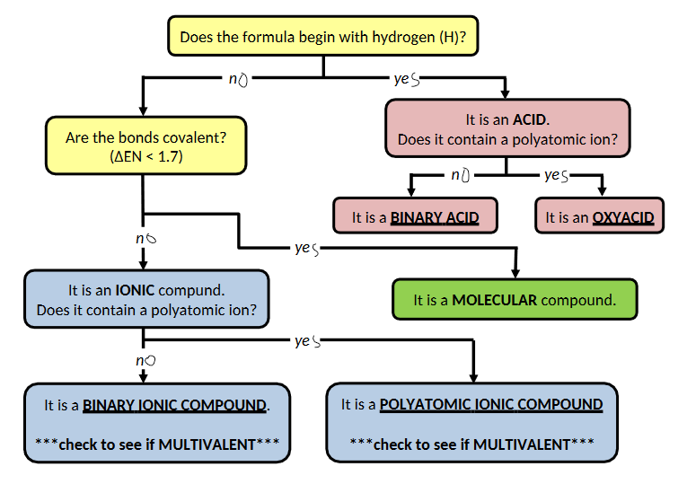
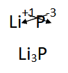
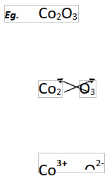
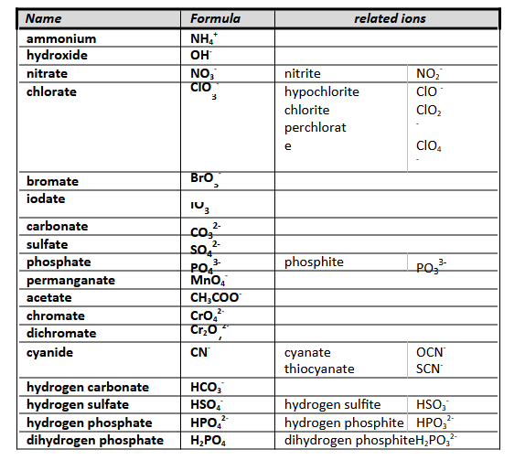

# C2.3 - Nomenclature

## Systems

- IUPAC: standardized set of rules to name chemical compounds (international)
- classical: the old way

## Flowchart

## Binary Ionic compounds

### Chemical Formula

1. Get charge of metal/cation and non-metal/anion
2. Cross over charges of each element to each element's subscript
3. Simplify the subscript ratios (i.e. $\text{Ca}_2\text O_2\rightarrow\text{CaO}$)

*i.e. lithium phosphide*

### Naming

1. First word is the name of the metal
2. Second word is the name of the non-metal, with the last syllable (ending) changed to **&ndash;ide**
   1. there are exceptions: selenium &rarr; selenide

*i.e. $\text{AlCl}_3$*

aluminum chlor**ide**

## Multivalent Ionic compounds

### Chemical Formula

Same rules as above, but the charge of the metal will be given by a roman numeral in the name

copper *(II)* = $\text{Cu}^{2+}$

### Naming

1. Determine charge of metal by reverse crossover
2. Check if the charge of the anion is right
3. If anion charge is wrong, multiply both charges by a # until anion charge is right
4. The first word is the name of the metal
5. Follow that by a roman numeral representing the metal's charge in brackets
6. End it with non-metal name in &ndash;ide

*Example of reverse crossover*

$\therefore$ It is called **cobalt (III) oxide**

*Example of charge ratio multiplication*

- Reverse crossover of $\text{FeO}$
- ...gives $\text{Fe}^+$ and $\text{O}^-$
- But oxygen has a charge of 2-
- Multiply both charges by 2
- ...to get $\text{Fe}^{2+}$ and $\text O^{2-}$

$\therefore$ It is called **iron (II) oxide**

## Polyatomic Ionic compounds

### Non-Exhaustive List

### Chemical Formulas

Same rules as binary ionic compounds, but polyatomic ions are used in place of anions (or cations)

**:warning: IMPORTANT**

If there is more than one polyatomic ion in the compound, put the ion in brackets, then add the subscript

DO NOT add brackets if there is only one polyatomic ion in compound

:white_check_mark: $\text{LiOH}$ (no brackets) &mdash; :white_check_mark: $\text{Al}_2(\text{CO}_3)_3$ (brackets around carbonate)

### Naming

Same rules as other ionic compounds, but no need to change name of the polyatomic ion

*i.e. aluminum carbonate* (no change to polyatomic ion name)

## Hydrates

**hydrate:** ionic compound with water molecules in its crystal

**water of hydration** *(a.k.a. crystallization)*: trapped water molecules in the crystal

**anhydrous:** no water molecule in crystal

### Formula

$$
\begin{equation*}
\text{ionic compound } \cdot n\text H_2\text O
\end{equation*}
$$

Means: For every unit of the ionic compound, there are also $n$ (int. number) water molecules

***Most hydrates appear dry***

### Naming

1. Name the ionic compound
2. The next word has...
   1. a greek prefix for the # of water molecules for each unit
   2. hydrate

**Greek Prefixes**

|Number|Prefix|Number|Prefix|
|------|------|------|------|
|1|mono|6|hexa|
|2|di|7|hepta|
|3|tri|8|octa|
|4|tetra|9|nona|
|5|penta|10|deca|

*Example:* $\text{NaCl}\:\cdot4\text H_2\text O$

sodium chloride tetrahydrate

## Molecular compounds

### Chemical Formula

1. The name is given to you
2. Use the greek prefix to identify # of non-metals in bond (no crossover)
3. Write the chemical symbol for each nonmetal, followed by a subscript showing the # of each atom in a compound
4. Only one atom of each element, no subscript
5. If the first word has no prefix, that means there is only one of that element

*i.e. carbon tetroxide* &rarr; $\text{CO}_3$

*i.e. dihydrogen monoxide* &rarr; $\text H_2 \text O$ (water is rarely called that name, even by chemists)

### Naming

1. Write the name of the first non-metal beginning with its prefix if there are more than 1
2. Write the name of the second element in &ndash;ide with its prefix (even if there is 1)
3. If the element is oxygen and the prefix ends with an "o" or "a", remove the last letter

*i.e.* $\text P_2 \text{Br}_5$ &rarr; **di**phosphorus **penta**brom***ide***

*i.e.* $\text{CO}$ &rarr; carbon **mon**ox***ide***

## Note about polyatomic ions

A lot of polyatomic ions with oxygen have names ending with **&ndash;ate**

*&uarr; Base elements*

For &ndash;ate elements

- 2 less oxygen: prefix is **hypo&ndash;**, ending is **&ndash;ite**
  - i.e. $\text{ClO}^-$ &rarr; *hypo*chlor*ite*
- 1 less oxygen: ending is **&ndash;ite**: 
  - i.e. ${\text{ClO}_2}^-$ &rarr; chlor*ite*
- base state: ending in &ndash;ate
  - i.e. ${\text{ClO}_3}^-$ &rarr; chlor*ate*
- 1 more oxygen: prefix is **per&ndash;**, ending remains unchanged
  - i.e. ${\text{ClO}_4}^-$ &rarr; *per*chlor*ate*

## Acids

### Chemical Formulas

Treat as ionic compounds except cation is always $\text H^+$

Anion should be identified from name

### Naming &mdash; Binary

1. First word begins with hydro
2. Then, add name of anion. Replace what would normally be *&ndash;ide* with **&ndash;ic**
   1. exception: sulfur (sulfide) &rarr; sulfuric
   2. exception 2: phosphorus (phosphide) &rarr; phosphoric
3. Last word should be Acids

*i.e. $\text{HCl}$* &rarr; ***hydro***chlor***ic*** *acid*

### Naming &mdash; Polyatomic

1. First word begins with name of anion
2. If name ends with *&ndash;ate*, replace it with **&ndash;ic**
3. If name ends with *&ndash;ite*, replace it with **&ndash;ous**
4. Watch out for exceptions
   1. sulfate/sulfite (prefix or no prefix) &rarr; sulfuric
   2. phosphate/phosphite &rarr; phosphoric

*i.e.* $\text H_2 \text{BrO}_3$ (anion is bromate) &rarr; brom**ic** acid

*i.e.* $\text{HClO}$ (anion is hypochlorite) &rarr; hypochlor**ous** acid