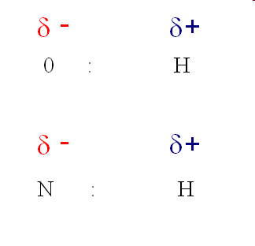
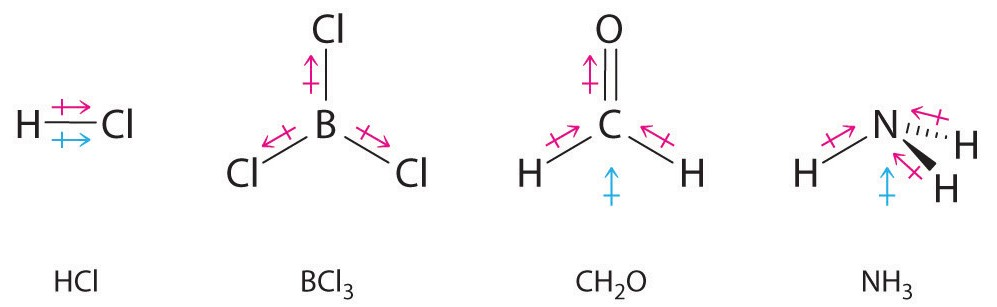
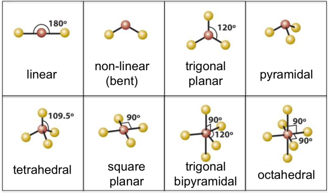
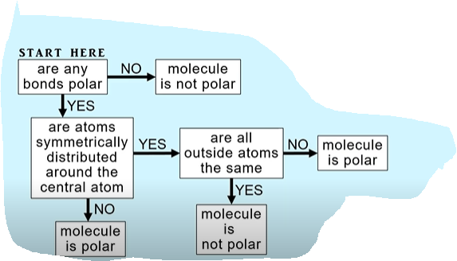

# C2.4 - Polarity

## Types of Covalent Bonding

- **non-polar bonding:** c. bond with equal sharing of electrons
  - formed with the bonding of 2 identical atoms or 2 atoms w/ equal electronegatives
  - example: diatomic elements
- **polar bonding:** c. bond with unequal sharing of electrons
  - formed when two atoms of different electronegatives bond
  - bonding electrons spend more time near the more electronegative atom

## Show polar bonds and partial charges

1. Draw bonding electrons closer to the more electronegative atom (symbol), *if necessary*
2. Draw a partial charge symbol above each chemical symbol
3. The more electronegative atom is slightly negative
4. The less electronegative one is slightly positive

### Partial Charges

- slightly positive: $\delta^+$
- slightly negative: $\delta^-$

## Electronegativity Differences

**electronegativity difference ($\Delta EN$):** difference of electronegatives of 2 bonding electrons

*Bond polarity increases as $\Delta EN$ increases*

Type of covalent bond can be determined using $\Delta EN$

|Type of Bond|$\Delta EN$|
|---|---|
|Non-Polar|< 0.5|
|Polar|0.5 - 1.7|
|Ionic *|> 1.7

*Example of N-H bond*

$$
\begin{gather*}
EN_\text{N}=3.0 \\
EN_\text{H}=2.1 \\
\Delta EN_\text{N-H}=3.0-2.1=0.9 \\
\therefore\textbf{N-H bond is polar}
\end{gather*}
$$

## Dipole

**dipole:** bond seperated into partial charges

*Vector arrow used to point towards more electronegative atom in Lewis structure*

## Molecular Polarity

**molecular polarity:** the overall (net) polarity of a molecule

***Factors***

- bond polarities
- molecular shape

### Polar Molecules

Molecules which results in a positive and a negative end

- polar molecules are **asymmetrical**
- polar bonds in the moucle **do not cancel each other out**
  
### Non-Polar Molecules

Molecules with no charged ends

- Either only contains non-polar bonds
- ... or non-polar bonds **cancel each other out**
- they are **symmetrical**

## Molecular Symmetry and Geometry

- **Symmetrical Shapes**
  - linear (1st image from top-left)
  - trigonal planar (3rd image)
  - tetrahedral (5th)
- **Asymmetrical Shapes**
  - bent (2nd)
  - trigonal pyramidal (4th)

## Determining Molecular Polarity

1. Determine the polarity of each bond by finding the $\Delta EN$ for each bond
2. Determine the symmetry based on the shape
3. Based on the symmetry,...
   1. If all bonds are non-polar, whole molecule is **non-polar**
   2. If shape is symmetrical and surrounding atoms are identical (or have same electronegatives), molecule is **non-polar**
   3. If shape is asymmetrical and polar bonds exist, molecule is **polar**

**Flowchart**

## Sources

- Mr. N. Singh
- [Dipole Moments - Lumen](https://courses.lumenlearning.com/suny-mcc-organicchemistry/chapter/dipole-moments/)
- [Shapes of simple molecules - chemistryclinic.co.uk](https://courses.lumenlearning.com/suny-mcc-organicchemistry/chapter/dipole-moments/)