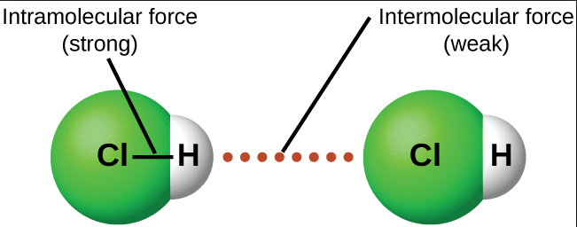
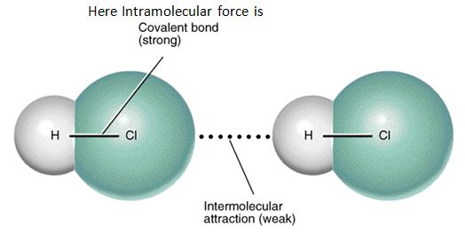
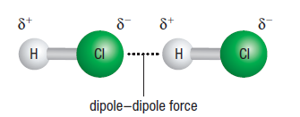
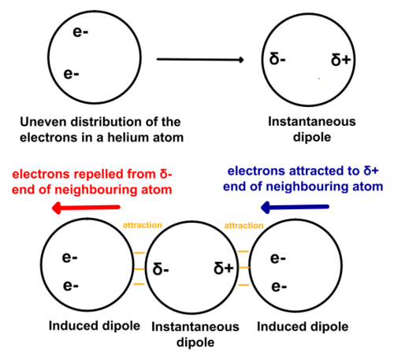
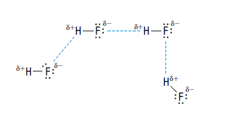
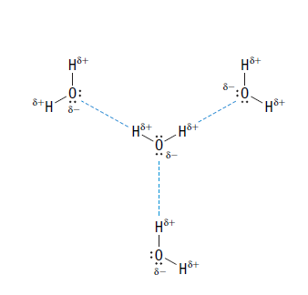
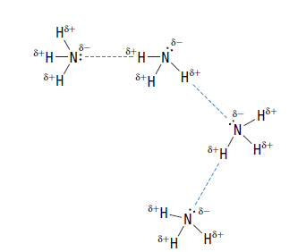
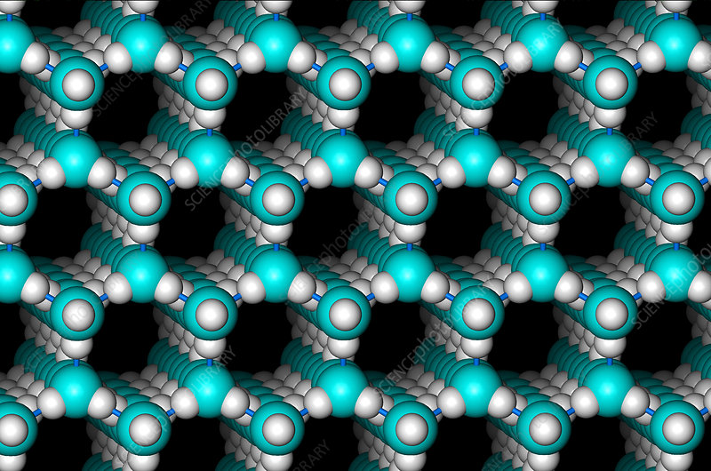

# C2.5 - Inter/intramolecular Forces

## Intermolecular Forces (IMFs)

***inter*molecular force:** attractive force between *molecules*

Force is weak

### Show IMFs

No IMFs in ionic compounds (including polyatomic ones) due to no molecules

## Intramolecular Forces

***intra*molecular force:** attractive force *within* a molecule or compound

They determine chemical properties

***Examples***: covalent and ionic bonds

### Intermolecular vs Intramolecular Forces

## Physical Properties due to IMF

Strength of IMF controls physical properties, like:

- Melting/boiling points
  - Physical state (solid, liquid, gas)
- Surface tension
- Hardness and texture
- Solubility

### Melting/Boiling Points

Molecules with stronger IMFs will have higher melting/boiling points

*Reason:* Stronger IMF = molecules attracted to each other more = more energy required to seperate molecules

## Types of IMFs

DDFs and LDFs are called ***Van der Waals Forces***

### Relative Strength of Bonding Forces

*higher avg. bond energy = stronger force*

|Bond|Avg. Bond Energy|Occurence|
|-|-|-|
|Covalent bonds|400 kcal|Within a molecule|
|Hydrogen bonding|12-16 kcal|Polar molecules w/ H-F, H-O, or H-N
|Dipole-dipole forces|2-0.5 kcal|Polar molecules
|London forces|<1 kcal|All molecules|

### Dipole-Dipole Forces (DDF)

**dipole:** polar molecule w/ two poles (any polar molecule)

**dipole-dipole force:** forces of attraction between oppositely charged ends of polar molecules

Higher polarity = Higher $\Delta EN$ = Stronger DDF

### London Dispersion Forces (LDF)

**London dispersion forces:** IMFs exerted by molecules due to electron movement

**Reasons:**

- Movement of electrons unevenly
- If there are more electrons on one side than the other at a given moment,...
- ... a small instantenous dipole is created
- A second atom's electrons are attracted to the positive end which causes a dipole in that atom too
- This short-term chain of dipoles creates IMFs
- **Weakest** of all forces

#### Factors affecting LDF strengths

- Size of molecule
  - bigger molecule have stronger LDFs
- Number of electrons
  - more electrons = stronger LDFs

#### Surprise

All molecules have LDFs, including polar molecules. 

However, LDFs are overpowered by DDFs and H-bonding

### Hydrogen Bonding (H-bonding)

**hydrogen bonding:** a special strong DDF that occurs when N, O, or F are bonded to H

Strength comes from high $\Delta EN$ originating from H (low EN) and N/O/F (high EN)

Special name given due to importance in biological systems like protiens and DNA

#### H-Bonding in hydrogen fluoride

#### H-Bonding in water

#### H-Bonding in ammonia

## Order of Boiling Points / IMF Energy

1. H-bonding molecules (generally)
2. Polar molecules
3. Non-polar molecules

## Hydrogen Bonding and Water

### Special Properties

- high boiling and melting points, compared to most molecular compounds
- universal solvent &mdash; dissolves any polar or ionic compound
- high surface tension &mdash; strong hydrogen bonds
- lower density of ice than liquid water
- high specific heat capacity

### Hydrogen Bonding in Ice

A crystalline structure is formed when water freezes to ice, since hydrogen bonding causes molecules to arrange themselves this way

### Sub-priorities

1. ionic compounds, if given
2. \# of polar bonds, if asymmetrical (don't cancel out)
   1. overall strength of polar bonds, higher $\Delta EN$
3. \# of electrons in molecule &rarr; higher LDF

## Sources

- Mr. N. Singh
- Nelson Chemistry 11
- https://www.sciencephoto.com/media/4812/view/molecular-structure-of-ice