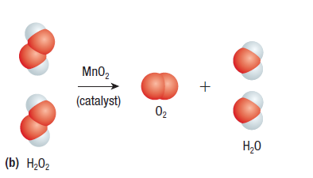

# C3.1 - Chemical Reactions and Balancing

## Chemical Reactions

**chemical reaction:** process where 1+ substances change into 1+ new substances

**reactants:** starting substances in a reaction

**products:** substances produced during the reaction

### How does it happen?

Reactant atoms rearrange to form products

\# of atoms at start = \# of atoms at end

**Reason:** atoms cannot be created or destroyed

*Chemical Equation*

reactant 1 + ... + reactant n &rarr; product 1 + ... + product n

- Reactants and products sep. by arrow, which means: yields, produces
- Substances on each side seperated by plus sign (+)

## Chemical Change Clues

- new colour
- bubbles of gas created
- precipitate formed
- heat/light emitted

**precipate:** solid produced when 2 liquids are mixed

## Law of Conservation of Mass

**law of conservation of mass:** mass of reactant = mass of products

## Types of Chemical Formulas

- **word equations:** the names of the substances are used, no balancing
- **chemical equations:** the chemical formulas are used in the overall reaction
  - balanced
  - states given
  - conditions required for reaction given

*Word Equation*

magnesium chloride + sodium &rarr; sodium chloride + magnesium

*Chemical Equation*

$$
\begin{equation*}
\text{MgCl}_2(s) + 2\text{Na}(s)\rightarrow 2\text{NaCl}(s) + \text{Mg}(s)    
\end{equation*}
$$

### State Symbols

- solid: $(s)$
- liquid: $(l)$
- gas: $(g)$
- aqueous, dissolved in water: $(aq)$

$\rightleftharpoons$ &mdash; used instead of arrow for reversible action

Above arrow, $\Delta$ and "heat" can indicate supply of heat

## Catalysts

**catalyst:** substance that makes chemical reaction go faster w/o itself changing in the reaction

Name or formula of catalyst is usually written above arrow

## Balancing Reactions

- Chemical reactions must have same \# of each atom on both sides
- Done by coeffecients before the equation
- Coeffecients multiply the \# of atoms in each reactant/product

**skeleton equation:** unbalanced chemical equation

### How to balance

1. If necessary, write word equation
2. Write skeleton equation
3. Draw an ARP table and count how many of each atom/polyatomic ion is on each side
4. Multiply each compound/element by coeffecients on each side until each atom on each side are equal
   1. start w/ atom in the least \# of compounds
   2. leave oxygen and hydrogen for last
5. Use ARP table to keep track
6. Note that coeffecients must be whole numbers; if coeffecient is 1, no need to write
7. Simplify coeffecients in the lowest whole \# ratio
   1. i.e. 4A + 2B --> 4C to 2A + B --> 2C

*ARP Table*

|Atoms|Reactants|Products|
|-|-|-|
|A|1|2|
|B|3|4|

### Alternate Method

1. From left to right, give each reactant/product a variable starting from "a"
2. For each atom or polyatomic ion on both sides, make an equation
   1. equation: # of atoms in product 1 * variable + ... # of product in item n * variable = # of atoms in product n
   2. example: $\text{H}_2+\text{O}_2\rightarrow\text{H}_2\text{O}$; for hydrogen: $2a=2c$
3. Define $a=1$, substitute and solve for other variables
4. If the values of any variable is a fraction, multiply all variables by the lowest number needed to become all whole numbers
5. The final values of the variables are the coeffecients for their respective reactant/product

## Types of Reactions

- synthesis
- decomposition
- single displacement
- double displacement
- combustion
- neutralization (type of double displ.)