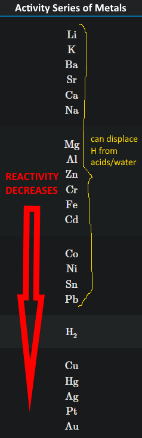
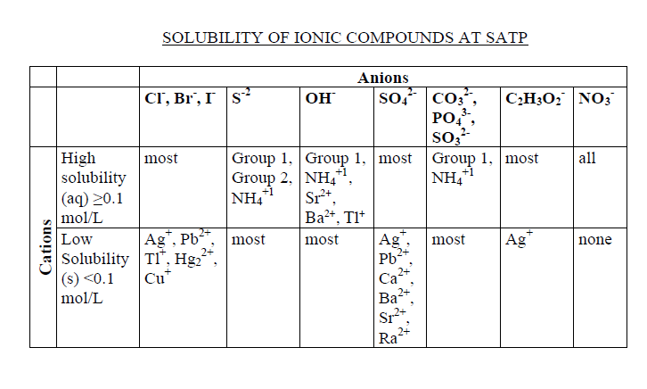

# C3.3 - Displacement Reactions

## Single Displacement

**single displacement reaction:** reaction where element displaces another element in a compound, resulting in a new compound and element

***General Equation***

$$
\begin{gather*}
A + BC \rightarrow AC+B \\
A + BC \rightarrow BA + C
\end{gather*}
$$

### General Types

1. metal displaces another metal from ionic compound
2. metal displaces hydrogen from acid/water
3. non-metal displaces another non-metal from ionic compound

### Activity Series

**activity series:** a list of metals or non-metals arranged w/ decreasing reactivity in displacement reactions

As you go ***down*** the series, *chemical **reactivity decreases***

*Not every single displacement reaction can occur*

**Types of Activity Series**

- Activity Series of Metals
- Activity Series of Halogens
- others not taught in G11

*Activity Series of Halogens*

From most to least reactive: $\text F_2(g), \text{Cl}_2(g), \text{Br}_2(l), \text I_2(aq/s)$

#### Rules

1. An element can displace elements below it
2. The further apart the two elements are, the faster the reaction will occur
3. Note: If displacing H from water, treat water as hydrogen hydroxide ($\text{HOH}$)

#### Examples

$$
\begin{gather*}
\text{Mg}(s)+\text{CuSO}_4(aq)\rightarrow\text{MgSO}_4(aq)+\text{Cu}(s) \tag 1 \\
\text{Pb}(s)+\text{Zn}(\text{NO}_3)_2(aq)\rightarrow\text{NR} \tag 1 \\
2\text{Na}(s)+2\text H_2\text O(l)\rightarrow2\text{NaOH}(aq)+\text H_2(g) \tag 2 \\
\text{Cl}_2(g)+2\text{KI}(aq)\rightarrow2\text{KCl}(aq)+\text I_2(s) \tag 3
\end{gather*}
$$

*NR means no reaction*

## Double Displacement

**double displacement reaction:** reaction where elements from two compounds displace each other (switch places) to form new compounts

***General Equation***

$$
\begin{equation*}
AB + CD \rightarrow AD + CB
\end{equation*}
$$

### Types of Double Displacement Reactions

- precipitation reaction
- double displ. reactions that produce a gas
- neutralization reactions

### Precipitation Reactions

**precipitation reaction:** DD reaction where two dissolved compounds react to form a precipitate

*Word General Equation:* aqueous compound + aqueous compound --> solid compound + aqueous (or rarely solid again) compound

- aqueous (aq): dissolved in water
- solid (s): this is the precipitate

#### Solubility Chart

This chart is used to determine the solubility of a compound

*To use:*

1. Look for the anion on the table
2. Look for the following cation in the next two rows
3. Options
   1. If cation is in high solubility &rarr; (aq)
   2. If cation in low solubility &rarr; (s)

#### If both products are soluble...

...then there is no reaction. Write NR or no reaction

#### Example of Precipitation Reaction

$$
\begin{equation*}
\text{KCl}(aq)+\text{AgNO}_3(aq)\rightarrow\text{KNO}_3(aq)+\text{AgCl}(s)
\end{equation*}
$$

### DD Reactions That Produce a Gas

above is self-explanatory

**General Equations for Different Cases:**

Note that all reactions happen with an acid

1. *sulfide* compound + acid &rarr; ionic compound + hydrogen sulfide
   1. example: $\text{MgS}(aq)+\text H_2\text{SO}_4(aq)\rightarrow\text{MgSO}_4(aq)+\text H_2\text S(g)$
2. *sulfite* compound + acid &rarr; ionic compound + sulfur dioxide + water
   1. ex. $\text K_2\text{SO}_3(aq)+2\text{HF}(aq)\rightarrow2\text{KF}(aq)+\text{SO}_2(g)+\text H_2\text O(l)$
3. *carboante* compound + acid &rarr; ionic compound + carbon dioxide + water
   1. ex. $\text{Na}_2\text{CO}_3(aq)+2\text{HCl}(aq)\rightarrow2\text{NaCl}(aq)+\text{CO}_2(g)+\text H_2\text O(l)$

### Neutralization Reactions

**neutralization reaction:** reaction between an acid (usually starts w/ H) and a base (usually ends w/ OH) to form an ionic compound and water

*General Equation (word):* acid + base (hydroxide) &rarr; salt + water

*Alternate Equation (word):* acid + carbonate &rarr; ionic compound + carbon dioxide + water

*General Equation:* $\text{HX}+\text{MOH}\rightarrow\text{MX}+\text H_2\text O$

*Alternate Equation:* $\text{HX}+\text{MCO}_3\rightarrow\text{MX}+\text{CO}_2+\text H_2\text O$

...where X and M are elements/polyatomic ions

- Reaction does not produce precipitates or gases
- Reaction can only be detected via a pH change
- The pH of the resulting solution should be close to 7 (neutral)

*Example*

$$
\begin{gather*}
\text H_2\text{SO}_4(aq) + \text{Ca}(\text{OH})_2(aq) \rightarrow \text{CaSO}_4(aq) + 2\text H_2\text O(l) \\

\end{gather*}
$$

## Sources

- Mr. N. Singh
- [College of Marin, 7.11: The Activity Series - LibreTexts Chemistry](https://chem.libretexts.org/Courses/College_of_Marin/CHEM_114:_Introductory_Chemistry/07:_Chemical_Reactions/7.11:_The_Activity_Series)