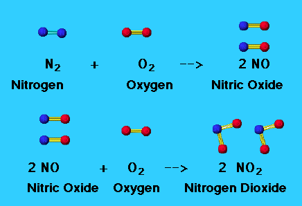
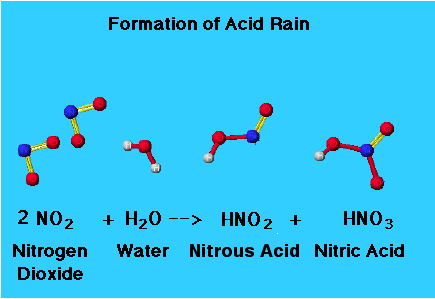

# C3.5 - Oxides

## Oxide

**oxide:** compound composed of oxygen and one other element

*General Equation of Oxide Formation:* element + oxygen &rarr; oxide

## Types of Oxides

- acidic oxide
- basic oxides

## Acidic Oxides

**acidic oxide:** oxide that forms an acid when it reacts with water

- non-metallic oxides, no metals
- gases at room temp.

*General Equations:*

non-metal + oxygen &rarr; acidic / non-metallic oxide

non-metallic oxide + water &rarr; acid

### Important Acidic Oxides

- sulfur oxides
- nitrogen oxides
- carbon dioxide ($\text{CO}_2$)
- they dissipate hydrogen ions when dissolved in water

### Carbon Dioxide

- reacts with water to form carbonic acid (synthesis)
- this reaction makes normal rain mildly acidic: pH of 5.6
- **acid rain:** rain w/ pH < 5.6
- contributes to global warming and climate change
- greenhouse gas
- makes oceans acidic: hampers growth (of shells) of many marine life
- cutting down trees (absorbs carbon dioxide) also increases it in the atmos.

### Nitrogen Oxides

- nitrogen and oxygen do not normally combine to form nitrogen oxides; high energy needed for them to combine
- natural processes like lightning strikes help form them
- most of them are by-product of combustion of fuels
- toxic respiratory irritant and helps form smog
- responsible for *acid rain*
- releases from car exhausts as gas
- **catalytic converter:** equipped in modern vehicles to convert nitrogen oxides to harmless nitrogen gas
- high temps. in car engine cause nitrogen to react to form nitrogen monoxide (NO)
- NO reacts with more oxygen to form nitrogen dioxide
- nitrogen dioxide reacts w/ water (i.e. rain) to form nitric acid

*Formation of Nitrogen Oxides*

*Formation of Nitric and Nitrous Acid*

### Sulfur Oxides

- sulfur dioxide is produced by burning sulfur, commonly found in fossil fuels
- it is also produced from volcanic activity (natural process)
- major contributor to *acid rain*
- sulfur dioxide reacts with oxygen to form sulfur trioxide
- sulfur trioxide reacts with water to form sulfuric acid

*Formation of Sulfur Dioxide, Sulfur Trioxide, and Sulfuric Acid*

$$
\begin{gather}
\text S(s/l) + \text O_2(g) \rightarrow \text{SO}_2(g) \\
2 \text{SO}_2(g) + \text O_2(g) \rightarrow \text{SO}_3(g) \\
\text{SO}_3(g) + \text H_2 \text O(l) \rightarrow \text H_2 \text{SO}_4(aq) 
\end{gather}
$$

## Basic Oxides

**basic oxide:** oxide that forms a base when reacting with water

*General Equations:*

metal + oxygen &rarr; metallic oxide
metallic oxide + water &rarr; metal hydroxide

### Uses

- sodium hydroxide used to make paper and detergents
- calcium oxide (common name: lime) and calcium hydroxide (a.k.a. slaked lime) used to neutralize water and soil affected by acid rain or spills
- **antacid:** weak base used to neutralize excess stomach acid (HCl, pH 1.6)
  - common ones are...
  - magnesium hydroxide
  - aluminum hydroxide
  - sodium hydrogen carbonate
  - calcium carbonate
  - weak bases used to not irritate the throat or stomach
  - NaHCO3 is not recommended to over-consume due to Na ions causing risk of hypertension and stroke
- **leavening agent:** base used to make bread dough rise
  - produce carbon dioxide gas to make bread rise, escapes from dough
  - neutralization reaction involving carbonate
  - baking soda (agent): pure sodium hydrogen carbonate
  - baking powder (agent): mix of baking soda and dry acid (i.e. tartaric acid)

## Neutralization with Carbonate

carbonate + acid &rarr; ionic compound + carbon dioxide + water

sodium hydrogen carbonate can neutralize both acids and bases

*neutralization of base with sodium hydrogen carbonate*

metal hydroxide (base) + sodium hydrogen carboante &rarr; metal carbonate + sodium hydroxide + water

sodium hydroxide (base) + sodium hydrogen carbonate &rarr; sodium carbonate + water