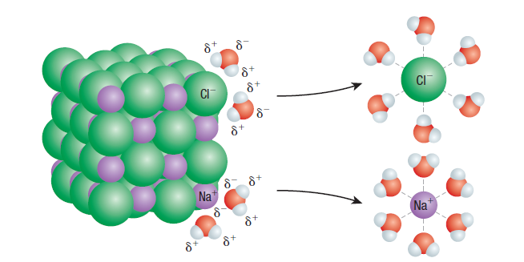
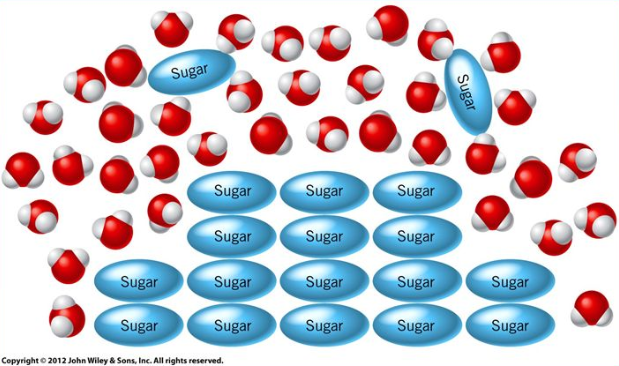
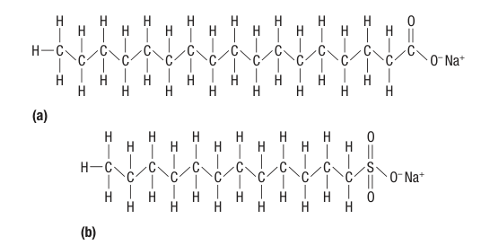
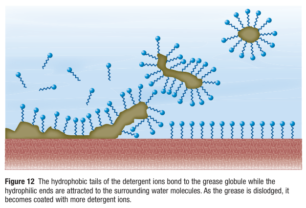
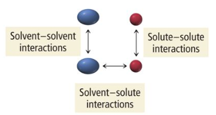

# C6.1 - Solutions

## Solution

**solution:** homogeneous mixture (uniform appereance) of 2+ substances with one phase

- **solute:** substance that is being dissolved (typically greater qty.)
  - before dissolving, substance can either be solid, liquid, or gas
- **solvent:** substance that does the dissolving (typically lesser qty.)

*Solutes dissolve in solvent and both components don't seperate over time*

**heterogeneous mixture:** a mixture with two phases; has a non-uniform appearance (i.e., oil and vinegar)

### Types of Solutions

- **liquid solutions:** solutions in the liquid state &mdash; solvent is liquid
    - **solution of liquids:** composed of a liquid solute and a liquid solvent
        - i.e. rubbing alcohol &rarr; isopropyl alcohol (solute), water (solvent)
        - i.e., antifreeze, used to cool engine &rarr; propylene glycol (solute), water (solvent)
    - water is sometimes considered the solvent even when it's in lesser amounts
    - **solution of gas in liquid:** composed of a gas solute and a liquid solvent
        - i.e., soda &rarr; carbon dioxide gas (solute), water (solvent)
        - i.e., cleaning solution &rarr; ammonia gas (solute), water (solvent)
    - **solution of solid in liquid:** composed of a solid solute and a liquid solvent
        - i.e., pop &rarr; flavouring and sugar (solutes), water (solvent)
    - **aqueous solution:** solution with water as the solvent &mdash; most common solvent in chemistry
        - i.e., window cleaner, mouthwash, peroxide, soda, tea, coffee, some juices, chemistry lab solutions
- **solutions of gases:** solutions that are in the gaseous state &mdash; gas solvent
  - i.e., air &rarr; solution of nitrogen, oxygen, and other gases
- **solutions of solids:** solutions that are in the solid state
  - **alloy:** solution of (2+) metals
    - stronger than pure metals
    - i.e., bronze (copper and tin) and steel (iron and carbon)

## Concentration

**concentration:** ratio of the quantities of solute to solvent/solution

- **concentrated solution:** solution with large qty. of solute dissolved per unit volume of solution
- **diluted solution:** solution with small qty. of solute dissolved per unit volume of solution

## Dissolving and Dissociation of Ionic Compounds (Hydration)

***STEP-BY-STEP PROCESS***

1. Ionic compound or salt is poured in water or another polar liquid
2. Since the liquid's molecules are polar ($\Delta EN_{\text H_2\text O} = 1.4$), they are attracted to both the cations and the anions
3. The solvent's molecules attach themselves to the ions and pull them away from the crystal
4. As ions are pulled away from the water molecule, they are surrounded by a sphere of water molecules

- **hydration:** the process where ions are surrounded by a sphere of water molecules
- **dissociation:** the separation of ions from their crystals when they're dissolved in water
  - equation format: $X_bY_a\rightleftharpoons X^{a+}+Y^{b-}$
  - example equation: $\text{NaCl}(s)\rightleftharpoons\text{Na}^+(aq)+\text{Cl}^-(aq)$

## Dissolving of Molecular Compounds and Miscible Mixtures

- **miscible mixture:** liquids that mix evenly and form a solution
- **immiscible mixture:** liquids that don't mix evenly and form a heterogenous mixture

### Process of molecular compound dissolving &mdash; POLAR

1. Polar molecular solute is mixed with a polar solvent like water
2. The opposite ends of the solute and the solvent attract each other (IMFs)
3. Solvent molecules surround the solute molecules and seperate them from their original state
4. Molecules are not dissociated

### Why Polar and Non-Polar Liquids Don't Mix

- non-polar liquids have molecules tend to be large and regular in shape
- result: the London dispersion forces hold the liquid together strongly and the non-polar molecules aren't attracted to the polar ones (like water)

### Surfactants (not taught, from textbook)

**surfactant:** substance that acts on the surface of a liquid, reducing surface tension &mdash; allows polar and non-polar molecules to "mix"

Surfactants are very long molecules with a charged end (hydrophilic end) and a long non-polar tail (hydrophobic end)

The hydrophobic end attracts the non-polar molecules like oil and the hydrophilic end attracts polar molecules like water

### Like Dissolves Like

Solutes are only able to dissolve in solvents when both the solvent and the solute are able to overcome the forces holding them together.

- **solute-solute attraction:** attractions between solute molecules/ions
- **solvent-solvent attraction:** attraction between solvent molecules
- **solute-solvent attraction:** attraction between solute molecules/ions and solvent molecules

#### Dissolving General Rules

- :white_check_mark: ionic compounds dissolve in polar solvents (high solute-solvent attraction)
- :white_check_mark: polar covalent compounds dissolve in polar solvents (high solu-solv att.)
- :x: non-polar covalent compounds do NOT dissolve in polar solvents (low solu-solv att.)
- :white_check_mark: non-polar covalent compounds DO dissolve in polar solvents (similar solu-solv. att.)
  - dissolves since london dispersion forces of solvent act along with the LDFs of solutes