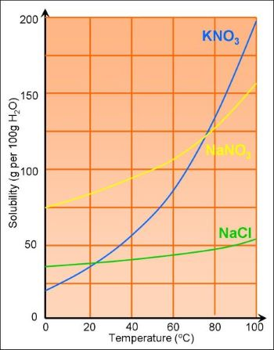
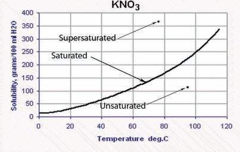
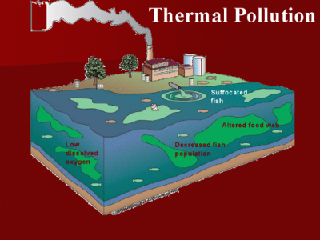
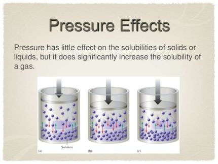

# C6.2 - Solubility and Saturation

## Types of Solution Based on Saturation

- **unsaturated solution:** solution whose solvent contains less solute than the maximum amount
  - can dissolve more solute
- **saturated solution:** solution whose solvent contains the maximum amount of solute
  - can't dissolve any more
- **supersaturated solution:** solution containing more solute than the maximum amount 
  - prepared by dissolving solute at high temps. and cooling it down or vice versa, then allowing solution to cool or heat up
  - extremely unstable: addition of a single crystal of solute can cause crystallization or gas release
  - i.e., carbonated drink
- **saturation:** the state of a solution being saturated

### Test for Saturation

- Add more solute
- If solution is saturated, no more solute will dissolve
- If solution is unsaturated, added solute will dissolve

## Solubility

**solubility:** the maximum mass of solute that can be dissolved in 100 g of water at any given temperature

**solubility curve:** a graph that shows the solubility of various substances

### Solubility Curve

Each point on the curve is the maximum solubility of that substance for the temperature below.

**TRENDS**

- Solubilities of most ionic compounds increase with rising temperatures
- Solubilities of gases decrease with rising temps.

**INTERPRETING**

- on the curve: saturated
- below the curve: unsaturated
- above the curve: supersaturated

### Solubility Calculations

mass of solute required to saturate a solution = saturation value - given value

mass of solute that will crystallize = given value - saturation value

## Solubility Phenomena

### Thermal Pollution

- cool, pressurized water contains more dissolved oxygen than warm water with less pressure
- explains why more fish is found deeper in waters during high surface temps.
- **thermal pollution:** the addition of warm water to an aquatic ecosystem

### Pressure and Gas Solubility &mdash; Soda Fizz

Solubility of a gas increases as pressure on the solution increases

Cold sodas can dissolve more carbon dioxide and therefore have more fizz

No gas bubbles in sealed pop can/bottle since pressurized gas above pop surface keeps carbon dioxide dissolved

Pressure decreases when pop can is opened and fizz starts to decrease

### Bends in Divers

**bends:** the rapid release of gas bubbles in bloodstream as a diver ascends

- As divers dive, pressure and water temp. decrease &mdash; blood and lungs dissolves more breathing gas
- As divers ascend, solubility increases and pressure reduction causes gas bubbles to be produced and rushed into the bloodstream
- Divers prevent bends by slowly ascending to the surface to allow the bubbles to safely escape out through our lungs

### Why the Coke-Mentos Trick Works (from textbook)

- Coke is a supersaturated solution with dissolved carbon dioxide
- The Mentos acts like a seed crystal to the Coke to rapidly trigger bubble formation
- As a result, a ka-boom happens