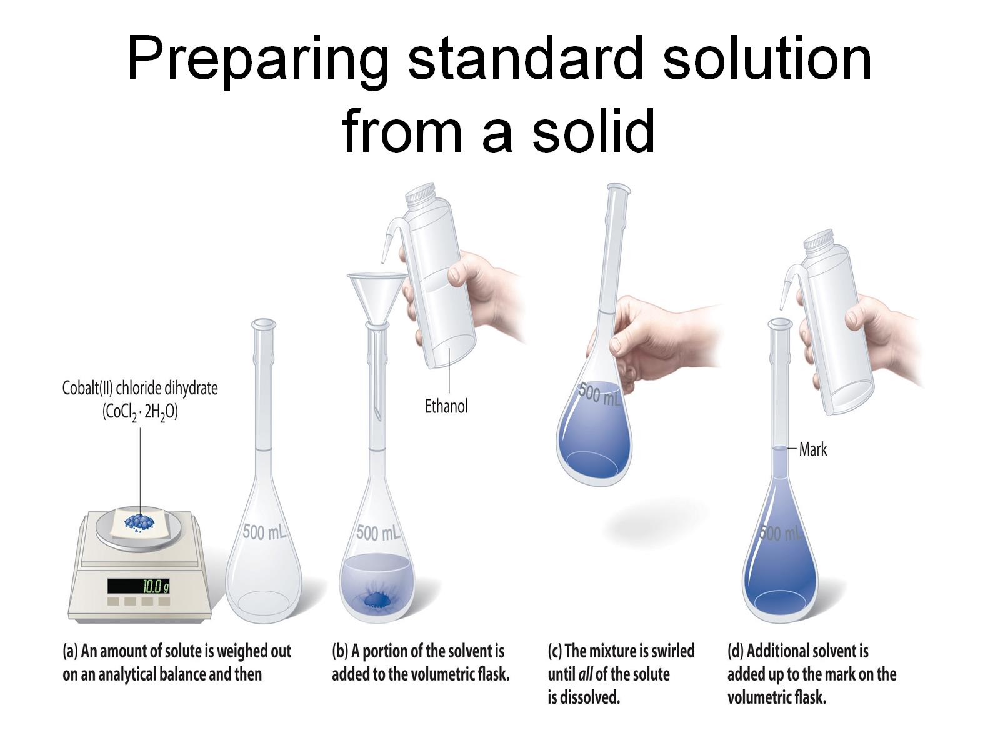
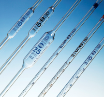

# C6.3 - Concentration

## Concentration

**concentration:** the quantity of a given solute per unit volume of solution

- **dilute solution:** solution with low concentration
- **concentrated solution:** solution with high concentration
- in general, concentration = qty. of solute / qty. of solution
- unit: moles per liter (mol/L or M)

let $c$ be concentration (mol/L), $n$ be amount of solute (mol), $V$ be volume of solution (L)

$$
\begin{equation*}
c = \frac n V
\end{equation*}
$$

*NOTE:* Volume is often expressed in mL &rarr; $\therefore 1\text{ L} = 1,000\text{ mL}$

## Preparation of Solutions in Lab

Chemical solutions in labs are prepared with solutions of known concentrations

- **stock solution:** concentrated solution used to prepare dilute solutions for use in lab
  - highly concentrated around 12-18 mol/L
  - solution must be diluted before use in an actual lab
- **standard solution:** solution whose precise concentration is known
  - prepared in volumetric flasks for accuracy

### How to prepare a standard solution with a solid solute

1. Know the required concentration and determine the required solute and solvent
2. Weigh the amount of solute until required amount reached
3. Pour the solute into a beaker and mix it with (100 mL of) water until solute is fully dissolved
4. Transfer dissolved solution to a volumetric flask of required volume
5. Add distilled water to the flask until it reaches the line on the volumetric flask

## Dilution

**dilution:** the process of decreasing the concentration of a solution by adding more solvent

*NOTE:* The amount of solute remains the same in both cases, only the concentration changes.

variables to be defined:

- $c_c$: concentration of concentrated solution (mol/L)
- $V_c$: volume of concentrated solution (L)
- $c_d$: concentration of dilute solution (mol/L)
- $V_d$: volume of dilute solution (L)

If the moles of solute of the concentrated and dilute solution are equal, then...

$$
\begin{equation*}
c_cV_c = c_dV_d
\end{equation*}
$$

### Dilution of Stock Solutions to Prepare Standard Solution

Only small amounts of stock solution is needed, graduated cylinders are not accurate for small amounts of liquids, ***pipettes*** used instead

**pipette:** a tool to precisely measure small amounts of liquids

- **volumetric pipette:** pipette that can measure only one volume, but very accurately
- **graduated pipette:** pipette that can measure a range of volumes

***STEPS***

1. Pipette the required amount of stock solution
2. Transfer solution to volumetric flask
3. Dilute solution to the mark
4. Invert / shake well to mix (block hole on top)

## Percentage Concentration (textbook)

concentration = quantity of solute / quantity of solution

### Percentage Volume/Volume (% V/V)

$$
\begin{equation*}
c_\text{V/V} = \frac{V_\text{solute}}{V_\text{solution}} \cdot 100\% 
\end{equation*}
$$

Can be listed like: 50% of isopropyl alcohol by volume

### Percentage Weight/Volume (% W/V)

$$
\begin{equation*}
c_\text{W/V} = \frac{m_\text{solute}}{V_\text{solution}} \cdot 100\% \tag{sans unit}
\end{equation*}
$$

Note that weight is used interchangeable with mass, but they are not the same

### Percentage Weight/Weight (% W/W)

$$
\begin{equation*}
c_\text{W/W} = \frac{m_\text{solute}}{m_\text{solvent}} \cdot 100\% 
\end{equation*}
$$

### Concentrations of Extremely Dilute Solutions (Special % W/W) 

- **parts per million (ppm):** 1 g of solute per 1 million grams of solvent
- **parts per billion (ppb):** 1 g of solute per 1 billion grams of solvent
- **parts per trillion (ppt):** 1 g of solute per 1 trillion grams of solvent

$$
\begin{gather*}
c_\text{ppm} = \frac{m_\text{solute}}{m_\text{solvent}} \cdot 10^6\text{ ppm} \\
c_\text{ppb} = \frac{m_\text{solute}}{m_\text{solvent}} \cdot 10^9\text{ ppb} \\
c_\text{ppt} = \frac{m_\text{solute}}{m_\text{solvent}} \cdot 10^{12}\text{ ppt} 
\end{gather*}
$$