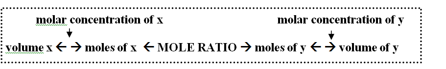

# C6.5 - Stoichiometry with Solutions

## Stoichiometry with Solution Format

Extremely similar to stoichiometry using moles and mass

Only volume and concentration is used with or instead of mass

### Important Equations

$$
\begin{gather}
n = \frac m M \\
m = nM \\
c = \frac n V \\
n = cV \\
V= \frac n C
\end{gather}
$$

## General Steps

1. Convert given solution into moles using concentration and volume (or mass and molar mass)
2. If there are more than one given solution, divide their molar values by the coefficient in the equation. The substance w/ the smallest value is the limiting reactant
3. Find the mole ratio of the required substance to the given/limiting substance
4. Multiply moles of given substance by the mole ratio to get moles of required substance
5. Convert moles of required substance to volume (using concentration) or mass

## Types of Questions

### 1. Determine Volume Needed to Precipitate a Compound

**Sample Question:** Solution of sodium chloride (c = 0.0823 mol/L) is added to 21.40 mL of silver nitrate (c = 0.962 mol/L). What is the minimum volume of sodium chloride required to precipitate all ions?

1. Write equation for the problem if necessary

$$
\begin{equation*}
\text{NaCl}(aq) + \text{AgCl}_3(aq) \rightarrow \text{AgCl}(s) + \text{NaNO}_3(aq)
\end{equation*}
$$

2. Calculate amount of silver nitrate. Make sure to convert mL to L

$$
\begin{gather*}
n = cV \\
n_{\text{AgNO}_3} = (0.962\text{ mol/L})(0.02140\text{ L})
n_{\text{AgNO}_3} = 0.0205868\text{ mol}
\end{gather*}
$$

3. Multiply the amount of silver nitrate by the mole ratio to get amount of sodium chloride

$$
\begin{align*}
n_\text{NaCl} &= (0.0205868\text{ mol AgNO}_3)(\frac{1\text{ mol NaCl}}{1\text{ mol AgNO}_3}) \\
&= 0.0205868\text{ mol NaCl}
\end{align*}
$$

4. Convert moles to volume

$$
\begin{align*}
V &= \frac n c \\
V_\text{NaCl} &= \frac{0.0205868\text{ mol}}{0.0823\text{ mol/L}} \\
&= 0.250\text{ L} = 250\text{ mL}
\end{align*}
$$

### 2. Mass of Precipitated Compound

**Sample Question:** If excess barium chloride is added to 50.0 mL of 0.469 mol/L potassium chromate solution, what mass of barium chromate will precipitate?

1. Write chemical equation if necessary

$$
\text{BaCl}_2(aq) + \text{K}_2\text{CrO}_4(aq) \rightarrow 2\text{KCl}(aq) + \text{BaCrO}_4(s)
$$

2. Find moles of limiting reactant (excess is given)

$$
\begin{align*}
n_{\text K_2\text{CrO}_4} &= (0.0500\text{ L})(0.469\text{ mol/L}) \\
&= 0.02345\text{ mol}
\end{align*}
$$

3. Find moles of required substance using mole ratio

$$
\begin{align*}
n_{\text{BaCrO}_4} &= (0.02345\text{ mol K}_2\text{CrO}_4)(\frac{1\text{ mol BaCrO}_4}{1\text{ mol K}_2\text{CrO}_4}) \\
&= 0.02345\text{ mol BaCrO}_4
\end{align*}
$$

4. Find molar mass of required substance (precipitate)

$$
\begin{align*}
M_{\text{BaCrO}_4} &= 137.33 + 52.00 + 4(16.00)\text{ g/mol} \\
&= 253.33\text{ g/mol}
\end{align*}
$$

5. Calculate mass of required substance

$$
\begin{align*}
m_{\text{BaCrO}_4} &= (0.02345\text{ mol})(253.33\text{ g/mol}) \\
&= 5.94\text{ g}
\end{align*}
$$

### 3. Stoichiometry with Unknown Limiting Reactant

For the following equation:

$$
\begin{equation*}
\text{Pb}(\text{CH}_3\text{COO})_2(aq) + \text{Na}_2\text S \rightarrow \text{PbS}(s) + 2\text{NaCH}_3\text{COO}(aq)
\end{equation*}
$$

What mass of lead(II) sulfide will be formed if 257.8 mL of 0.0468 mol/L lead(II) acetate is added to 156.0 mL of 0.095 mol/L sodium sulfide?

1. Find quantity (moles) of all reactants

$$
\begin{align*}
n_{\text{Pb}(\text{CH}_3\text{COO})_2} &= (0.2578\text{ L})(0.0468\text{ mol/L}) \\
&= 0.01206504\text{ mol} \\
n_{\text{Na}_2\text S} &= (0.1560\text{ L})(0.095\text{ mol/L}) \\
&= 0.01482\text{ mol}
\end{align*}
$$

2. Divide quantities by the element's coeffecient. The element w/ the smallest value is the limiting reactant.

$$
\begin{gather*}
n_{\text{Pb}(\text{CH}_3\text{COO})_2/1} = 0.01206504\text{ mol}/1 = 0.01206504\text{ mol} \\
n_{\text{Na}_2\text S/1} = 0.01482\text{ mol}/1 = 0.01482\text{ mol} \\
L.R. = \text{Pb}(\text{CH}_3\text{COO})_2
\end{gather*}
$$

3. Find quantity of required product using mole ratio

$$
\begin{align*}
n_\text{PbS} &= (0.01206504\text{ mol Pb}(\text{CH}_3\text{COO})_2)(\frac{1\text{ mol PbS}}{1\text{ mol Pb}(\text{CH}_3\text{COO})_2}) \\
&= 0.01206504\text{ mol PbS}
\end{align*}
$$

4. For this question, mass is required &mdash; Find molar mass of product

$$
\begin{equation*}
M_\text{PbS} = 207.20\text{ g/mol} + 32.06\text{ g/mol} = 239.26\text{ g/mol}
\end{equation*}
$$

5. Convert quantity to mass

$$
\begin{align*}
m_\text{PbS} &= (0.01206504\text{ mol})(239.26\text{ g/mol}) \\
&= 2.9\text{ g}
\end{align*}
$$

### 4. Determine Concentration of Ions in Solution

**Sample Problem:** 17.1 g of aluminum sulfate has been dissolved in 250.0 mL of water. What are the concentrations of aluminum and sulfate?

1. Write dissociation equation of ions

$$
\begin{equation*}
\text{Al}_2(\text{SO}_4)_3(s) \leftrightharpoons 2\text{Al}^{3+}(aq) + 3{\text{SO}_4}^{2-}(aq)
\end{equation*}
$$
   
2. Determine moles of solute (using molar mass or concentration)

$$
\begin{gather*}
M_{\text{Al}_2(\text{SO}_4)_3} = 2(26.98) + 3(32.07 + 4[16.00])\text{ g/mol} = 342.17\text{ g/mol} \\
n_{\text{Al}_2(\text{SO}_4)_3} = \frac{17.1\text{ g}}{342.17\text{ g/mol}} = 0.0499752\text{ mol}
\end{gather*}
$$

3. Determine concentration of entire solution &mdash; *Make sure to convert mL to L!*

$$
\begin{align*}
c &= \frac n V \\
c_{\text{Al}_2(\text{SO}_4)_3} &= \frac{0.0499752\text{ mol}}{0.2500\text{ L}} \\
&= 0.199908\text{ mol/L}
\end{align*}
$$

4. For each ion, multiply found concentration with its coefficients on the right side of the dissociation equation

$$
\begin{gather*}
c_{\text{Al}^{3+}} = 2(0.199908\text{ mol/L}) = 0.400\text{ mol/L} \\
c_{{\text{SO}_4}^{2-}} = 3(0.199908\text{ mol/L}) = 0.600\text{ mol/L}
\end{gather*}
$$