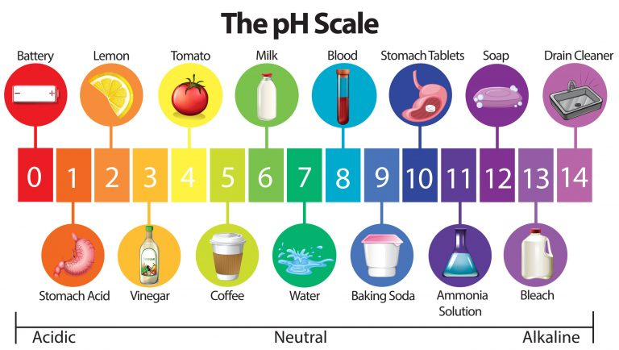

# C6.6 - Acids and Bases

## Acids, Bases, Properties, and Nomenclature

**acid:** compound whose chemical formula starts with one or more hydrogen atoms (excluding water), or who has a pH lower than 7

**base:** compound whose chemical formula ends in hydroxide, or who has pH higher than 7

**alkali:** a base of an alkali and an alkaline earth metal

### Properties

- acids
  - sour taste
  - pH <7
  - turns litmus paper from blue to red
  - reacts with metals above hydrogen on activity series to produce hydrogen gas
  - reacts with carbonates to produce carbon dioxide gas
  - reacts with hydroxide bases to produce an ionic compound and water
- bases
  - bitter taste
  - feels slippery or soapy
  - pH >7
  - turns litmus paper from red to blue
  - reacts with acids to produce ionic compound and water

### Nomenclature

- Binary acids (w/o oxygen) start with prefix "hydro-" and end with "-ic acid"
- Oxyacid naming is based on the name of its oxyanion:
  - If oxyanion name ends in -ate, acid name ends in "-ic acid"
  - If oxyanion name ends in -ite, acid name ends in "-ous acid"
- Bases are named by the name of metal cation followed by "hydroxide" (if it is an OH base)

## Arrenhieus Theory of Acids and Bases

**acid:** molecular compound that ionizes to produce hydrogen ions in water

i.e., $\text{HCl}(g)\leftrightharpoons\text H^+(aq)+\text{Cl}^-(aq)$

**base:** ionic compound that dissociates into metal and hydroxide ions as it dissolves into water

i.e., $\text{Ca(OH)}_2(s)\leftrightharpoons\text{Ca}^{2+}(aq)+2\text{OH}^-(aq)$

**ionization:** formation of ions from uncharged molecules

*Ionization is different from dissociation since dissociation seperates existing ions whereas ionization forms new ions from molecules*

### Limitations

Some substances have basic properties but do not contain hydroxide ions

i.e. **calcium carbonate** + hydrochloric acid &rarr; calcium chloride + carbon dioxide + water

## Neutralization

**neutralization:** reaction where acid and base react to form an ionic compound and water (other gases like carbon dioxide may be produced [carbonates])

### Net Ionic Equation for Neutralization

$$
\begin{gather*}
\text H^+(aq) + \text{OH}^-(aq) \rightarrow \text H_2\text O(l) \tag{hydroxide} \\
2\text H^+(aq) + {\text{CO}_3}^{2-}(aq) \rightarrow \text{CO}_2(g) + \text H_2\text O(l) \tag{carbonate}
\end{gather*}
$$

## Strong vs. Weak Acids and Bases

The strength of an acid or a base depends on how much it ionizes/dissociates in an aqueous solution.

- **strong acid:** acids that completely ionize (100%) in water to form ions
  - no molecules remaining
  - excellent conductors of electricity because of 100% ion dissociation
  - i.e., hydrochloric acid, sulfuric acid, nitric acid
- **weak acid:** acids where only a small percentage of its molecules ionize in the solution
  - do not ionize completely in water, molecules remaining
  - poor conductors of electricity due to little ionizating
  - i.e., acetic acid, carbonic acid, boric acid
- **strong base:** bases that completely dissociate (100%) in water to form ions
  - excellent conductor of electricity
  - i.e., sodium hydroxide (no NaOH formula units in solution)
- **weak base:** bases where only a small percentage of it dissociates to form ions
  - poor conductor of electricity
  - i.e., ammonia, sodium hydrogen carbonate (baking soda)

### Common Strong Acids

- hydrochloric acid
- hydroiodic acid
- hydrobromic acid
- sulfuric acid
- nitric acid
- chloric acid
- perchloric acid

### Common Strong Bases

- lithium hydroxide
- sodium hydroxide
- potassium hydroxide
- rubidium hydroxide
- cesium hydroxide
- francium hydroxide (predicted)
- calcium hydroxide
- strontium hydroxide
- barium hydroxide
- radium hydroxide (no real-world applications)

## The pH Scale

**pH:** measure of how acidic or basic a solution is, whose scale ranges from 0 to 14

- **acid:** solution with pH <7
- **neutral solution:** solution with a pH of 7
- **base:** solution with pH >7

$$
\text{pH} = -\log_{10} c_{\text H_2\text O}
$$

- a change of 1 pH unit is a tenfold change of a solution's acidity or basicity
- if solution A's pH is 1 lower than solution B's pH, solution A is 10x more acidic than B
- if solution C's pH is 1 higher than solution D's pH, solution C is 10x more basic than D

### Calculate times a substance is more acidic/basic based on pH

1. Find the absolute difference between the two pH
   1. $\Delta\text{pH}=|\text{pH}_1-\text{pH}_2|$
2. Raise ten to the power of the difference found
   1. let x be times more acidic/basic
   2. $x=10^{\Delta\text{pH}}$
3. The solution with the lower pH is $x$ times more acidic than the one with the higher pH
4. ...or the solution w/ the higher pH is $x$ times more basic than the one w/ the lower pH

## Sources

- https://chemistrytalk.org/what-is-ph/
- https://www.australianenvironmentaleducation.com.au/education-resources/what-is-ph/
- https://www.thoughtco.com/list-of-strong-and-weak-acids-603642
- https://www.thoughtco.com/most-common-strong-bases-603649