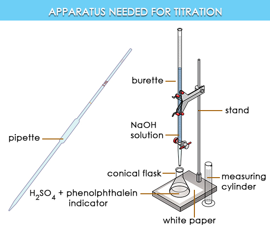
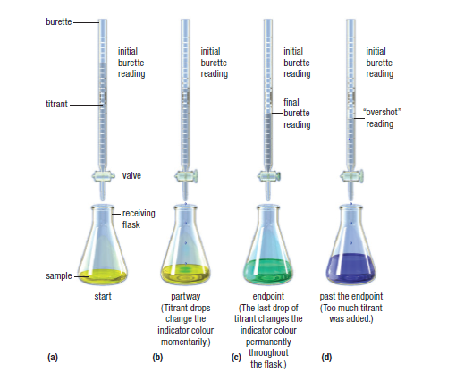
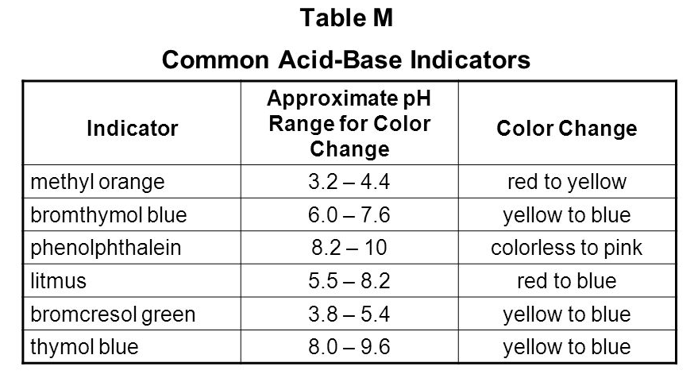

# C6.7 - Acid-Base Titration

## Titration

**titration:** procedure for determining the concentration of an unknown solution with a standard solution using neutralization

> **Real-life usage of titration:** Check whether milk is spoiled or not, since bacteria break down lactose in milk into lactic acid over time.
>
> Titration used to check concentration of lactic acid

### Principle of Titration

- a substance with a known concentration (acid or base) is used to determine the concentration of an unknown substance (opposite of known substance)
- a base is used to titrate an acid
- an acid is used to titrate a base

### Parts and General Procedure

- **titrant:** standard solution w/ a measured volume
- **burette:** a calibrated tube used to deliver known volumes of liquid / titrant
- **pipette:** a precise tool to accurately measure volume of substance (with unknown concentration)
- **indicator:** a chemical that changes colour when it detects a change in pH
  - when it completely changes colour, the neutralization reaction is assumed to be completed
  
---

- titrant from the burette is slowly added to the unknown substance until end point is reached
- end point is reached when indicator completely changes colour

*Sub NaOH solution with titrant and remove H2SO4 + phelnolphthalein*

## Titration Procedure

1. Fill burette with titrant of specified volume
2. Pipette a specific volume of unknown substance in Erlenmeyer flask
3. Pipette indicator in Erlenmeyer flask
4. Record starting volume of buret
5. Add small amounts of titrant to solution until colour starts to change
6. Swirl flask and keep adding titrant until colour of indicator has fully changed
7. When colour has fully changed, end point has been reached. Stop adding titrant
8. Record final volume of buret

## Equivalance and End Point

**equivalance point:** point in titration when neutralization is fully complete

**end point:** point during titration when a sudden change in an observable property of the solution occurs

|End Point|Equivalance Point|
|-|-|
|sudden observable change|theoretical|
|occurs when indicator produces permanent colour change|occurs when acid and base is neutralized
|depends on type of indicator used|depends on stoichiometry of reaction

### Maintaining Accuracy and Precision

- To make accurate observations, end point must equal equivalence point
- Procedure should be repeated at least 3 times to maintain precision
- Accurate observations are made by selecting the right indicator
- The correct indicator would change colour when the equivalance point is reached
  - so that end point and equivalance point coincide
- Indicators change colour over range of pH values and the ideal one would change colour during the steep portion of a titration graph

**Types of Indicators**

## Titration Calculations

**Titration Equation:**

let $u$ be unknown substance, $k$ be known substance, $c$ be concentration (mol/L), $V$ be volume (L), $\frac{n_u}{n_k}$ be mole ratio

$$
\begin{equation*}
\frac{c_uV_u}{c_kV_k} = \frac{n_u}{n_k}
\end{equation*}
$$

### Find unknown concentration from titration data

**Sample Problem:** Titration of 10.0 mL of sulfuric acid was done using a solution of 0.100 mol/L sodium hydroxide. Table below shows data from experiment. Find concentration of sulfuric acid.

||Trial 1|Trial 2|Trial 3|
|-|-|-|-|
|Final burette reading (mL)|12.52|24.98|37.62|
|Inital burette reading (mL)|0.10|12.52|25.10|
|Volume of titrant added (mL)|?|?|?

1. Find volume of titrant added for each trail by subtracting the initial burette reading from the final reading

||Trial 1|Trial 2|Trial 3|
|-|-|-|-|
|...|...|...|...|
|Volume of titrant added (mL)|12.52 - 0.10 = 12.42|24.98 - 12.52 = 12.46|37.62 - 25.10 = 12.52|

2. Calculate average volume of titrant added and convert to litres. This is the volume of the known substance.

$$
\begin{equation*}
V_\text{NaOH} = \frac{12.42\text{ mL} + 12.46\text{ mL} + 12.52\text{ mL}} 3 = 12.4667\text{ mL} = 0.0124667\text{ L}
\end{equation*}
$$

3. Write balanced equation of titration reaction

$$
\text H_2\text{SO}_4(aq) + 2\text{NaOH}(aq) \rightarrow \text{Na}_2\text{SO}_4(aq) + 2\text H_2\text O(l)
$$

4. Find mole ratio and use titration equation to solve for unknown conentration

$$
\begin{align*}
\frac{c_{\text H_2\text{SO}_4}V_{\text H_2\text{SO}_4}}{c_\text{NaOH}V_\text{NaOH}} &= \frac{n_{\text H_2\text{SO}_4}}{n_\text{NaOH}} \\
\frac{c_{\text H_2\text{SO}_4}(0.0100\text{ L})}{(0.100\text{ mol/L})(0.0124667\text{ L})} &= \frac 1 2 \\
\frac{(0.0100\text{ L})c_{\text H_2\text{SO}_4}}{0.00124667\text{ mol}} &= \frac 1 2 \\
(0.0100\text{ L})c_{\text H_2\text{SO}_4} &= \frac{0.00124667\text{ mol}} 2 \\
(0.0100\text{ L})c_{\text H_2\text{SO}_4} &= 0.000623335\text{ mol} \\
c_{\text H_2\text{SO}_4} &= 0.0623\text{ mol/L}
\end{align*}
$$