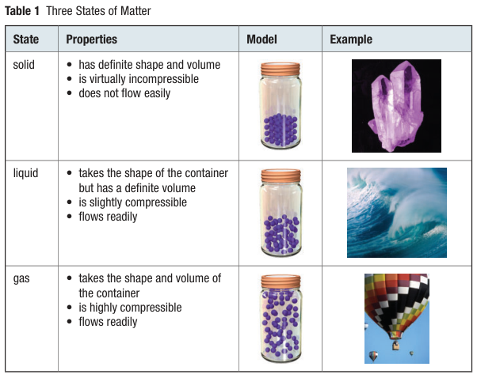
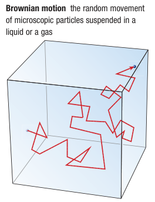
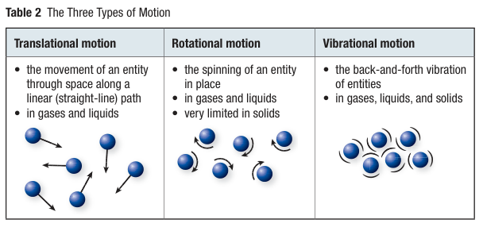

# C7.1 - States of Matter and Kinetic Molecular Theory

## States of Matter

- **solid:** matter w/ definite shape and volume
  - virtually incompressible
  - does not flow easily
  - most organized
- **liquid:** matter w/ definite volume, but no definite shape
  - takes shape of container
  - slightly compressible
  - flows easily
  - intermediate organization
- **gas:** matter w/ no definite shape or volume
  - takes shape and volume of container
  - highly compressible
  - flows easily
  - least organized

## Kinetic Molecular Theory

- **Brownian motion:** random movement of microscopic particles suspended in a liquid or gas
  - observed by Scottish scientist Robert Brown (1773-1858)
- **Kinetic Molecular Theory (KMT):** idea that all substances are composed of entities that are in constant, random motion
  - as entities move, they collide w/ other objects on their path

## How Entities Move

- **translational motion:** movement of an entity through space along a straight-line path
  - in gases and liquids
- **rotational motion:** spinning of an entity in place
  - in gases and liquids
  - very limited in solids
- **vibrational motion:** back-and-forth vibration of entities
  - in all 3 states

### Table of States, Motion, and Organization

||Solids|Liquids|Gases|
|-|-|-|-|
|Types of motion|vibrational|vibrational, rotational, translational|vibrational, rotational, translational|
|Strength of attraction|strongest|intermediate|weakest|
|Organization of entities|highly organized|intermediate organization|least organized|

## Kinetic Energy and Temperature

- **kinetic energy:** energy of an entity due to its motion
- **temperature:** measure of the average kinetic energy of particles