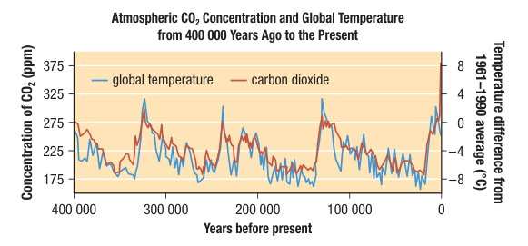

# C7.2 - Atmosphere

## Layers of the Atmosphere

- **troposphere:** layer closest to Earth's surface
  - warmest near Earth's surface
  - solar energy absorbed by Earth converted into thermal energy for nearby molecules
  - air movements in troposphere help determine our weather
- **stratosphere:** dry layer that contains slightly more concentration of ozone than normal
  - ozone can trap UV radiation from Sun and convert it into molecular kinetic energy (thermal energy)
  - temp. in stratosphere increases w/ altitude
- **mesosphere:** upper middle layer extending from 50 km to ~85 km
  - low gas concentrations, incl. ozone
  - temp. decreases w/ increasing altitude
- **thermosphere / ionosphere:** top layer extending beyond 85 km, which ionizes solar radiation
  - molecules absorb high-energy radiation and ionize them
  - emits visible radiation in the process, like auroras
  - ionization warms thermosphere

Atmosphere most dense near surface of Earth, sea level. Concentrations of air decreases w/ increasing altitude, incl. oxygen.

Air molecules pushed together by atmosphere above them

## Composition of the Atmosphere

- **nitrogen:** most abundant gas in atmosphere
  - found in proteins and DNA
  - nitrogen cycle: nitrogen-fixing bacteria convert nitrogen into soluble nitrates
  - nitrogen release through decaying organic matter
- **oxygen and ozone:** 2nd most abundant gas in atmosphere
  - two types: diatomic oxygen ($\text O_2$) and ozone ($\text O_3$)
  - makes up 21% by volume of atmosphere
  - required for cellular respiration
  - ozone has low concentrations, up to 10 ppm
  - absorbs UV light effectively, acts as radiation shield
- **Other Gases:** i.e., argon, water vapour, carbon dioxide
  - top three make up majority of remaining gases in atmosphere
  - *argon:* colourless, odorless, chemically inert, 1-3% of atmos. by vol.
  - Over 99% of water vapour in troposphere, part of water cycle
  - *Carbon dioxide* is 0.036% of lower atmos. by vol.
    - used by plants to make energy-rich molecules like glucose
    - released as waste from cellular respiration

|Gas|% composition by vol.|Concentration (ppm)|
|-|-|-|
|nitrogen|78.08|780,800|
|oxygen|20.95|209,500|
|argon|0.934|9,340|
|carbon dioxide|0.036|360|
|neon|0.001 818|18.18|
|helium|0.000 524|5.24|
|methane|0.000 2|2|
|krypton|0.000 114|1.14|

## Greenhouse Effect &amp; Climate Change

**greenhouse effect:** natural process where gases and clouds absorb IR radiation from Earth's surface and radiate it, heating Earth's surface

**greenhouse gas (GHG):** gas that traps infrared radiation

GHGs exists for mil. of yrs.

Events like volcanic eruptions, continental drift, changes in solar energy / ocean circulation, and meteor strikes affect global temp.

Climate change occuring in past decades due to GHG emissions from human activities

## Reducing Emissions

- Eco-friendly products and practices
- Government programs to promote "green"
- 3 Rs and using public transport instead of driving
- **carbon sequestration:** process of removing carbon dioxide and other carbon forms from atmosphere
  - *biological sequestration:* plants naturally remove carbon dioxide
  - *geological sequestration:* capturing and storing carbon dioxide in underground deposits