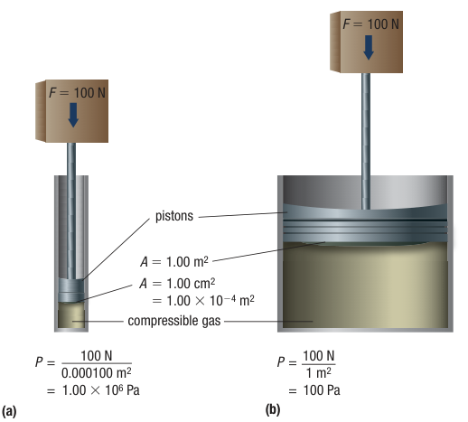
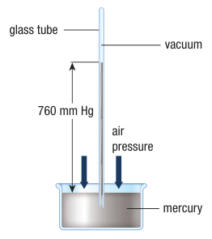

# C7.4 - Atmospheric Pressure

## Pressure

- **pressure:** force per unit area
  - the greater the area and the lesser the force, the lower the pressure
  - why there is less pressure on object on many nails over one nails
  - SI unit: Pa (pascal) &rarr; ($1\text{ Pa}=1\text{ N/m}^2$)

*Pressure equation*

let $P$ be pressure, $F$ be force, $A$ be area

$$
\begin{equation*}
P = \frac F A
\end{equation*}
$$

*Pressure illustration*

## Measuring Atmospheric Pressure

- **atmospheric pressure:** pressure exerted by air on all objects
- **standard pressure:** atmospheric pressure at sea level, 101.325 kPa (~101 kPa)
- **standard temperature and pressure (STP):** traditional standard gas conditions: 0 &deg;C and standard pressure
- **standard ambient temperature and pressure (SATP):** new standard conditions for gases: 25 &deg;C at 100 kPa

### Measuring Atmospheric Pressure via Mercury

- Evangelista Torricelli (1608-1674): 1st person to devise method of measuring atmospheric pressure
- Experiment
    - Mercury filled in tube, then tube inverted w/ open end submerged in dish w/ more mercury
    - Mercury pulled down by gravity, but not all mercury run out of tube
    - Air pressure pushed on mercury in dish, pushing mercury up tube
    - Mercury level in tube fluctuated slightly due to changing air pressure
- **barometer:** device used to measure air pressure, system in experimeter
- Standard pressure was historically defined as 760 mm Hg (or Torr) [in tube]
- Scientists came up with own ways to measure pressure before standardization

*Torcelli's barometer*

### Units of Pressure

|Unit Name|Symbol|Definition/Conversion|
|-|-|-|
|pascal|Pa|$1\text{ Pa}=1\text{ N/m}^2$|
|millimeters mercury|mm Hg|760 mm Hg = 1 atm|
|torr|Torr|1 Torr = 1 mm Hg|
|atmosphere|atm|1 atm = 101.325 kPa (exact)|
|pounds per square inch|psi|1 psi = 6,895 Pa|

## Atmospheric Pressure and Altitude

Density of gases and air pressure decreases as altitude (height above ground / sea level) increases

- Reason why ears hurt when altitude changes quickly
- Volume of gases increases and presses eardrum out
- Can stop discomfort by allowing air to flow from middle ear to throat (via Eustachian tubes)
  - "popping" sensation in ears
- Tankers collapse when pressure inside tank is lower than atmospheric pressure