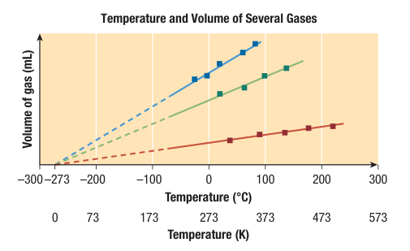
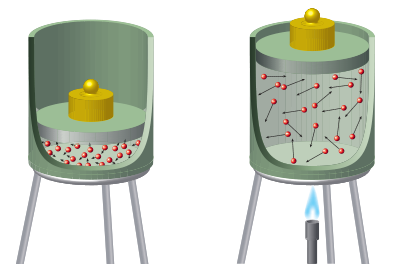
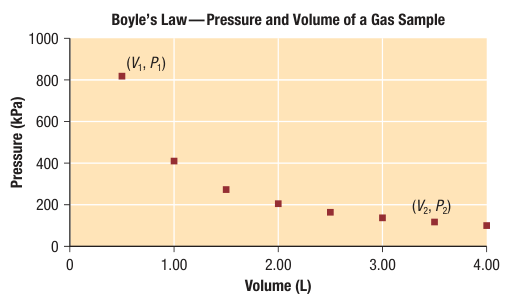
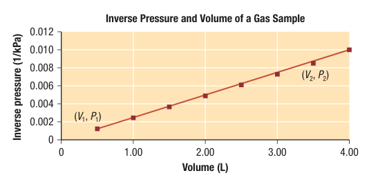
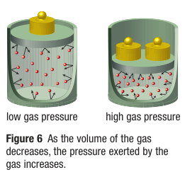
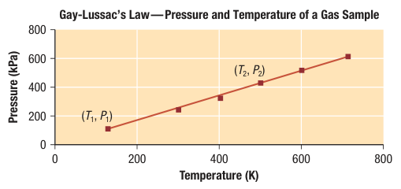

# C7.5 - Gas Laws

## Absolute Zero and Temperature Scales

- Celsius scale developed by Swedish scientist Anders Celsisus, 1742
  - convenient for most everyday situations
  - scale devised by taking thin, closed glass tube of pure liquid (i.e. mercury), then recording height when placed in ice water or boiling water
  - "100 degrees" &rarr; height of boiling water
  - "0 degrees" &rarr; height of ice water
  - 2 marks divided evenly into 100 pieces &rarr; ea. piece is 1 degree

### Kelvin Scale

- Volumes of gases measured as temperature decreased
- Volumes of gases stop at a point, but theoretical volumes can be extended
- Theoretical volumes of gases all originate from -273.15 &deg;C, where V = 0
- Lord Kelvin first scientist to notice this
- **absolute zero:** theoretical temperature where a gas has no volume, lowest possible temperature, -273.15 &deg;C (~273 &deg;C)

- **Kelvin temperature scale:** new temperature scale which uses Celsius divisions and starts at 0 from -273.15 &deg;C
  - a.k.a. absolute temperature scale
  - starting from 0 ensures no negatives
  - SI unit: Kelvin (K)
- **absolute temperature:** measurement of average kinetic energy of entities in substance

*Temperature conversions*

let $T_K$ be temp. in K, $T_C$ be temp. in &deg;C

$$
\begin{gather*}
T_K = T_C + 273.15 \\
T_C = T_K - 273.15
\end{gather*}
$$

## Charles's Law &mdash; Volume-Temperature Relationship

- Understanding of volume-temp. relationship attributed to French scientist Jacques Charles (1746-1823)
- Charles's Investigation
    - Charles investigated expansion of varieties of gases by placing them in a closed, expandable container (i.e. sealed by free-to-move piston)
    - Charles found out the volume of gas increases w/ increasing temperature
    - As each gas cools, it eventually condenses, cannot measure gas volume beyond condensation
- **Charles's Law:** law that states the volume of a gas is inversely proportional to its temperature, as long as pressure and amount of gas is constant

*Charles's Law Equation*

let $V$ be volume (L/mL), $T$ be absolute temperature (K), $a$ be constant

$$
\begin{gather*}
V = aT \\
\frac{V_1}{T_1} = \frac{V_2}{T_2}
\end{gather*}
$$

Celsius not used bcz. doubling of Celsius does not result in doubling of volume

### Explanation

- Temp. of gas increases &rarr; kinetic energy of entities increases
- \# of collisions between wall of container and entities also increases
- makes container expand and increases gas volume

## Boyle's Law &mdash; Volume-Pressure

**Boyle's Law:** law that states as the volume of gas increases, pressure decreases proportionally, as long as temp. and amount of gas remain constant

- Breathing, expansion and contraction of law example
- Named after British scientist Robert Boyle

### Volume-Pressure Relationships

*Relationship between volume and pressure*

*Relationship between volume and inverse of pressure*

Graphs show that volume is inversely proportional to pressure

Product of pressure and volume give a constant value

#### Boyle's Law Equations

let $P$ be pressure, $V$ be volume, $k$ be constant

$$
\begin{gather*}
PV = k \\
P_1V_1 = P_2V_2 
\end{gather*}
$$

### Explanation

As volume of gas decreases, molecules are more tightly packed and colliding more with its container. Pressure on container increases.

## Gay-Lussac's Law &mdash; Temperature-Pressure

**Gay-Lussac's Law:** pressure of gas increases proportionally as its temperature increases, as long as the volume and amount of gas remain constant

Named after French scientist Gay-Lussac

*Temperature vs. Pressure graph*

Analysis of 2 data points used for law

*Gay-Lussac's Law Equations*

let $T$ be absolute temperature (K), $P$ be pressure, $k$ be constant

$$
\begin{gather*}
PT = k \\
\frac{P_1}{T_1} = \frac{P_2}{T_2} 
\end{gather*}
$$

## Combined Gas Law

**combined gas law:** statement where product of volume and pressure of a gas is proportional to its absolute temp. (K)

*Equations*

let $P$ be pressure, $V$ be volume, $T$ be absolute temp. (K), $k$ be constant

$$
\begin{gather*}
\frac{PV}T = k \\
\frac{P_1V_1}{T_1} = \frac{P_2V_2}{T_2}
\end{gather*}
$$

