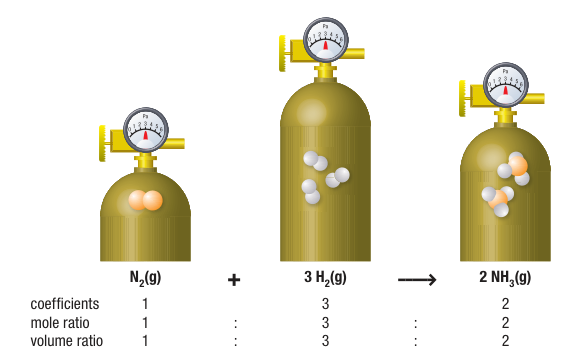
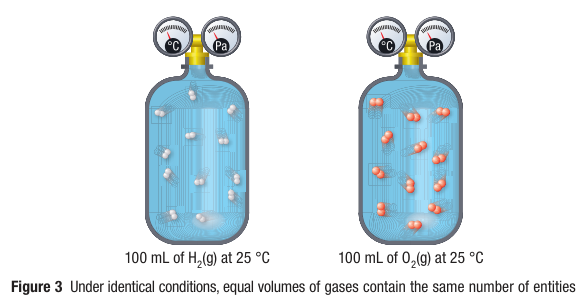
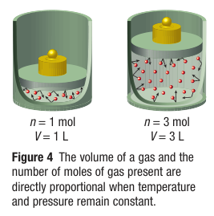

# C8.1 - Avogadro's Law and Molar Volume

## Law of Combining Volumes

**law of combining volumes:** law where volumes of gaseous reactants and products of chemical reactions are always in whole number ratios if at same temp. and pressure

- Developed by French scientist Gay-Lussac in 1808
- Measured relative volumes of gases in chemical reactions
- Had no explanation of this law, Avogrado provided explanation

## Avogadro's Law

- Developed by Italian scientist Amedeo Avogadro
- Based on combined gas law (C7.5), since entities have same kinetic energy
- Under identical conditions, equal volumes of gases contain equal \# of entities
- Combined Boyle's, Charles's, and Gay-Lussac's Law to create his own hypothesis

**Avogadro's Law:** law that the volume of a gas is directly related to the amount of gas, when temp., pressure, volumes, and \# of entities remain constant (= for vol. and ent.) under identical conditions

*Equations*

let $V$ be volume, $n$ be amount of gas, $k$ be constant

$$
\begin{gather*}
\frac V n = k \\
\frac{V_1}{n_1} = \frac{V_2}{n_2} 
\end{gather*}
$$

## Molar Volume

**molar volume:** the volume that one mole of gas occupies at a specific temp. and pressure

- 1 mol of any gas at STP occupies 22.4 L (22.414 L)
- 1 mol of any gas at SATP occupies 24.8 L

$$
\begin{gather*}
n = \frac V {V_n}
\end{gather*}
$$