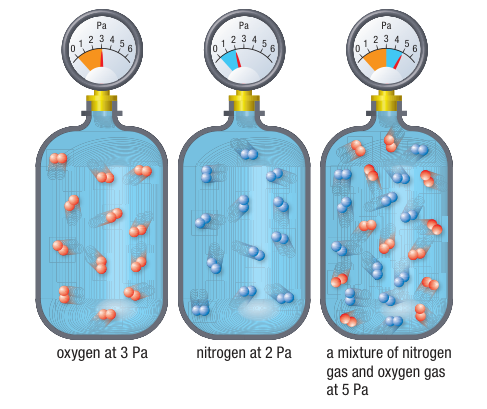
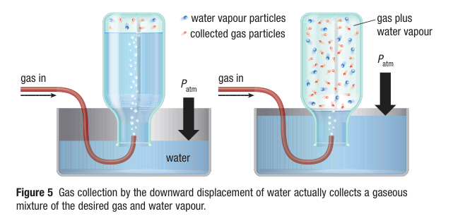

# C8.3 - Law of Partial Pressures

## Partial Pressure + Law

- **partial pressure:** pressure that gas in a mixture would exert if it were the only gas present in the same volume and same temperature
  - developed by John Dalton
  - published discovery in 1805
- **Dalton's Law of Partial Pressures:** law where total pressure of mixture of non-reacting gases is equal to sum of partial pressures of individual gases

*Dalton's Law*

let $P$ be pressure, $n$ be # of last gas, not amount

$$
\begin{equation*}
P_\text{total} = P_1 + P_2 + ... + P_n 
\end{equation*}
$$

*Partial pressures illustration*

## Collecting Gas over Water

Gas can be collected by:

1. Submerging a bottle with water
2. Bubble in gas using pipe into bottle
3. Gas forces water out of bottle

Dalton's law

$$
\begin{gather*}
P_\text{total} = P_\text{atm} = P_\text{gas in} + P_\text{water vapour} \\
P_\text{gas in} = P_\text{atm} - P_\text{water vapour}
\end{gather*}
$$